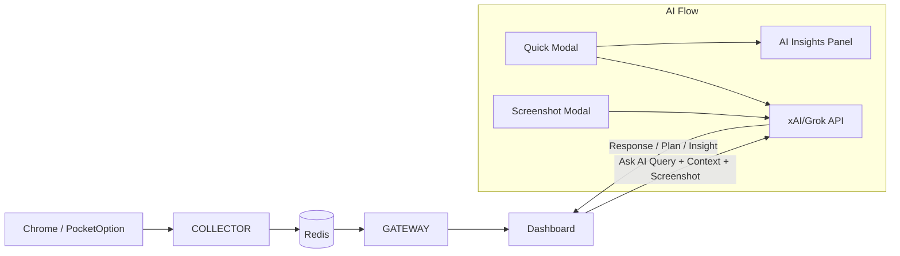

# QuFLX v2 – AI Integration Strategy for the "Ask AI" Feature

**Date:** 2025-12-19  
**Last Updated:** 2026-01-10  
**Audience:** Product Owner, Engineering, Quant/Trading Research  
**Context:** Follows `reports/report_25-12-19.md`, `reports/implementation_report_25-12-19.md`, `Research/research_ai_integration_vision_files_2025-12-20.md`, and `reports/ai_trading_integration_architecture_report_25-12-23.md`

---

## 1. Purpose & Vision

The goal of the **Ask AI** feature is to turn QuFLX v2 from a passive analytics dashboard into an **interactive trading assistant** that:

- Understands the **current market context** visible in the dashboard (ticks, candles, indicators, payout assets, session time, etc.).
- Understands the **user's intent** expressed in natural language.
- Uses the xAI API (Grok) with **multimodal capabilities** (text + vision) to:
  - Explain what is happening in the market.
  - Surface patterns or risks that might not be obvious visually.
  - Suggest next steps (analysis tasks, environment checks, or automated actions).

This document outlines **what we can do** with such an integration, **what capabilities become possible**, and **how this can increase trading edge** when implemented correctly.

---

## 2. Current Implementation Status

### 2.1 ✅ Implemented Components

| Component | File | Status | Description |
|-----------|------|--------|-------------|
| **AI Service (Backend)** | `backend/services/ai/service.py` | ✅ Complete | xAI/Grok API wrapper with text + vision support |
| **AI Ask Endpoint** | Gateway `/api/v1/ai/ask` | ✅ Complete | REST endpoint accepting prompt, context, and image |
| **Screenshot Modal** | `gui/Dashboard/src/components/ScreenshotModal.jsx` | ✅ Complete | Full annotation tools (line, arrow, rect, text) |
| **Chart Actions** | `gui/Dashboard/src/components/ChartActions.jsx` | ✅ Complete | Screenshot + Ask AI buttons with sound effects |
| **AI Insights Panel** | `gui/Dashboard/src/components/AiInsightsPanel.jsx` | 🟡 Scaffold | Placeholder panel for conversations |
| **Data Contracts** | `docs/DATA_CONTRACTS.md` | ✅ Complete | API contracts for `/api/v1/ai/ask` |

### 2.2 🟡 Partially Implemented

| Component | Status | What's Missing |
|-----------|--------|----------------|
| AI Modal (Quick Q&A) | 🟡 | Not implemented - currently `onAskAi` callback exists but no modal UI |
| Screenshot → AI Link | 🟡 | ScreenshotModal has no "Send to AI" integration |
| AI Panel Chat UI | 🟡 | Empty placeholder, needs chat interface |
| Context Builder | 🟡 | Basic context passed, needs TradingContext structure |

---

## 3. High-Level Integration Model

From the perspective of the existing QuFLX v2 pipeline (Collector → Redis → Gateway → Dashboard), the Ask AI feature slots in as an additional service:



### 3.1 Core Flow for "Ask AI"

1. **User clicks "Ask AI"** in the ChartHeader (ChartActions component).
2. Frontend collects:
   - The user prompt (e.g., "Is volatility increasing on AUDNZD_OTC in the last hour?").
   - Structured context from the store:
     - Selected asset, timeframe, current chart window.
     - Recent candles / ticks aggregated in the frontend.
     - Payout assets list and any open automation state.
   - **Optional**: Chart screenshot (base64) for vision analysis.
3. Frontend calls `POST /api/v1/ai/ask` that:
   - Validates and normalizes the context payload.
   - Calls the **xAI API** with a suitable prompt + structured data + optional image.
   - Returns an AI response plus optional structured suggestions.
4. Frontend renders the result in an **AI Modal** (quick response) or **AI Insights Panel** (extended chat).

This keeps the existing Collector/Redis/Gateway streaming path intact and merely adds an AI "advisor" layer on top.

---

## 4. Recommended UX Architecture

### 4.1 Hybrid Modal + Panel System (Best of Both Worlds)

| Interaction Type | Where It Happens | Why | Trading Benefit |
|------------------|------------------|-----|-----------------|
| **Quick Insight** | Modal (popup) | Fast context-specific answers without leaving chart focus | Faster decision-making during active trading |
| **Extended Chat** | AI Insights Panel (sidebar) | Multi-turn conversations, history, coaching | Deep analysis without time pressure |
| **Screenshot Analysis** | Modal → Panel handoff | Annotate → Send → Results appear in Panel | Visual pattern recognition assistance |

### 4.2 "Send to AI" Button in ScreenshotModal ⭐ NEW

**Recommended Implementation:**

```
[Screenshot Modal Header]
Line | Arrow | Rect | Text | Undo | Clear | [🧠 Send to AI] | Close | Save
```

**User Flow:**
1. User captures screenshot → Modal opens with annotation tools
2. User optionally annotates (circles a pattern, arrows pointing to key areas)
3. User clicks **"🧠 Send to AI"** button
4. Modal shows brief loading state, then:
   - **Option A**: Display AI response in a mini panel within the modal
   - **Option B** (Recommended): Auto-close modal, open AI Insights Panel with the annotated screenshot + AI analysis

**Why This Works:**
- Keeps screenshot workflow intact (annotate → save)
- Adds AI capability without cluttering the modal
- Leverages the existing Vision API architecture (base64 image + context)
- **Trading Benefit**: Users can highlight specific chart patterns and get instant AI interpretation

### 4.3 Ask AI Button → Smart Modal with Escalation

When user clicks the AI chip button in ChartActions:

**Phase 1 - Quick Modal (Default):**
```
┌─────────────────────────────────────────────┐
│  🤖 Ask AI about AUDNZD_OTC · 1m           │
├─────────────────────────────────────────────┤
│  ┌─────────────────────────────────────┐   │
│  │ What's the current trend?           │   │
│  └─────────────────────────────────────┘   │
│                                             │
│  📎 Include chart screenshot   [ Toggle ]   │
│                                             │
│  [Cancel]                      [Ask →]      │
└─────────────────────────────────────────────┘
```

**Phase 2 - AI Response:**
```
┌─────────────────────────────────────────────┐
│  🤖 AI Response                    [📌 Pin] │
├─────────────────────────────────────────────┤
│  The current trend on AUDNZD_OTC shows...   │
│  • Strong bullish momentum (last 12 bars)   │
│  • RSI divergence forming at 68.5           │
│  • Volatility: Moderate (ATR: 0.00045)      │
│                                             │
│  [Ask Follow-up]   [Open in AI Panel →]     │
└─────────────────────────────────────────────┘
```

**Key Features:**
- **📎 Include screenshot toggle**: Auto-captures chart and sends to Vision API
- **📌 Pin**: Keeps the insight visible as a floating badge on the chart
- **Open in AI Panel →**: Escalates to full chat mode in sidebar for follow-ups

**Trading Benefit**: Quick situational awareness without context-switching; option to dive deeper when needed.

### 4.4 AI Insights Panel Design (Sidebar)

Transform the empty `AiInsightsPanel.jsx` into a full conversation interface:

```
┌─────────────────────────────────────────┐
│ 💬 AI Insights           [Clear] [−]    │
├─────────────────────────────────────────┤
│                                         │
│ ┌─────────────────────────────────────┐ │
│ │ 📷 [Annotated Screenshot Thumbnail] │ │
│ │ "What pattern is this?"             │ │
│ └─────────────────────────────────────┘ │
│                                         │
│ 🤖 This appears to be a descending     │
│    wedge pattern. Key observations:    │
│    • Converging trendlines...          │
│                                         │
│ ─────────────────────────────────────── │
│                                         │
│ You: "Should I wait for breakout?"     │
│                                         │
│ 🤖 Given current volatility, I'd       │
│    recommend waiting for confirmation..│
│                                         │
├─────────────────────────────────────────┤
│ ┌─────────────────────────────────┐     │
│ │ Type a follow-up question...    │ [→] │
│ └─────────────────────────────────┘     │
└─────────────────────────────────────────┘
```

**Trading Benefit**: Extended coaching sessions for strategy refinement; conversation history provides learning reference.

---

## 5. Types of AI Capabilities for This Use Case

### 5.1 Contextual Explanations of Current Market State

**Goal:** Help the trader understand what the current chart is saying without manually checking every detail.

**Examples:**
- "Summarize the last 50 candles for AUDNZD_OTC on the 1m timeframe."
- "Explain the current trend and volatility vs. the previous session."
- "What stands out on this chart that I should pay attention to?"

**Implementation Notes:**
- Frontend sends:
  - Down-sampled candle data (e.g. last 50–100 candles)
  - Selected indicators (if available later from the Strategy service)
  - Basic meta info (asset, timeframe, local time, session window)
- AI prompt examples:
  - "Given this OHLC series and timeframe, describe trend, volatility, and any obvious patterns in concise language suitable for an intraday options trader."

**Trading Benefit:** Speeds up situational awareness: instead of manually scanning patterns, the user gets a quick summary. Helps newer traders interpret price action in a structured way.

---

### 5.2 Pattern & Regime Detection

**Goal:** Use AI to describe **market regimes** beyond simple indicators.

**Examples:**
- "Is the market ranging or trending over the last 200 bars?"
- "Have there been any repeated spike patterns around this session time?"
- "Does the current behavior look like previous high-volatility periods in my history?" (future extension with backend historical data).

**Implementation Notes:**
- Use the same candle/tick context as 5.1, but add higher-level prompts:
  - "Label this segment as trending up/down, ranging, or choppy, and explain why."
  - "Estimate how often candles close near their extremes (suggesting momentum) vs mid-range (suggesting noise/range)."

**Trading Benefit:** Better session selection: AI can label conditions as favorable/unfavorable for the user's strategy style. Potential to tier sessions: "avoid these hours" / "focus on these windows" based on regime descriptions.

---

### 5.3 Session & Time-of-Day Analysis

**Goal:** Help the trader identify **profitable times to trade** based on volatility, payout, and other features.

**Examples (future when more data is in DB):**
- "Compare current volatility on AUDNZD_OTC vs the last 10 sessions at this time."
- "Which 1-hour blocks historically had the most favorable conditions for my strategy?"

**Implementation Notes:**
- Backend can query historical candles or tick-derived statistics for a given asset, timeframe and time-of-day window.
- AI receives aggregated stats (not all raw data) and summarizes.

**Trading Benefit:** More disciplined schedule: trade primarily when conditions historically support the strategy. Avoid overtrading in poor conditions.

---

### 5.4 Cross-Asset Scanning & Ranking

**Goal:** Use AI to **prioritize assets** based on current metrics and the trader's criteria.

**Examples:**
- "Among all 92% payout assets currently streaming, which ones show the clearest trend?"
- "Rank my payout assets by volatility and clean structure over the last 50 bars."
- "Which assets currently show similar behavior to AUDNZD_OTC last week when I performed well?" (future, with performance data).

**Implementation Notes:**
- Frontend or backend supplies:
  - A list of assets (e.g., `payoutAssets`) with summary stats per asset: recent volatility, direction, change %, maybe a simple pattern label.
- AI prompt instructs the model to **rank** or **cluster** assets and justify.

**Trading Benefit:** Faster rotation into good setups, rather than staying on a single default asset. AI can reduce cognitive load when scanning many symbols.

---

### 5.5 Visual Chart Analysis (Vision API) ⭐ NEW

**Goal:** Leverage Grok's multimodal (Vision) capabilities to analyze chart screenshots directly.

**Examples:**
- "What pattern is forming on this chart?" (with annotated screenshot)
- "Do you see any divergences between price and the RSI indicator?"
- "Analyze this consolidation zone I've marked."

**Implementation Notes:**
- Frontend captures chart via `canvas.toDataURL('image/png')`
- User can annotate using ScreenshotModal tools before sending
- Backend sends to xAI with `grok-4-vision` model variant
- AI receives both structured data context AND visual image

**Trading Benefit:** AI can "see" patterns that are difficult to describe numerically (wedges, channels, flag patterns). Annotations help focus AI attention on specific areas of interest.

---

### 5.6 Explanation of Automated Actions & Capabilities

QuFLX v2 already has automation hooks (e.g., favorites selection via capabilities, future pending orders). AI can:

- Explain **what a capability does** in user language:
  - "Explain what the 92% payout asset sweep does and when to use it."
- Suggest **which automation to run next** based on current context:
  - "Should I run the 92% favorites sweep now for OTC assets?"

**Implementation Notes:**
- Backend exposes a small catalog of capabilities with metadata: name, description, inputs, effects.
- AI is instructed to **never execute** a capability by itself but to propose it as a suggestion with an explicit confirmation step.

**Trading Benefit:** Helps the user understand and safely use complex automations. Bridges the gap between configuration-level tools and high-level goals ("I want to find the best assets right now").

---

### 5.7 Risk & Psychology Coaching (Future)

**Goal:** Provide **soft guidance** around discipline and risk management, leveraging the RiskManager app and trading logs.

**Examples (requires more data integration):**
- "Given my last 20 trades, what recurring mistakes do you see?"
- "Does my current session match my planned risk parameters?"

**Trading Benefit:** Keeps the trader aligned with their plan, not just the market conditions.

---

## 6. Integration Modes for the xAI API

### 6.1 Stateless Q&A Mode ✅ Currently Implemented

**Description:** Each Ask AI request is independent. We send:
- Prompt text.
- Current chart/asset context.
- Optional screenshot (base64).

AI responds with a **single answer**. No long-running conversation.

**Pros:**
- Simple to implement; minimal state to manage.
- Easy to cache or deduplicate queries.

**Cons:**
- Limited ability to build multi-step plans.
- Repeats context overhead for each request.

**Fit:** Good for initial rollout: explanations, quick assessments, and one-off suggestions.

---

### 6.2 Stateful Session / Chat Mode 🟡 Planned

**Description:** Maintain an AI conversation per user or per browsing session.
- Each query includes a conversation ID.
- Backend stores past exchanges and passes them to the API for context.

**Pros:**
- AI can remember user preferences (risk appetite, favorite setups, frequently used assets).
- More natural coaching & multi-step analysis.

**Cons:**
- Requires careful handling of context length and storage.
- Must avoid leaking sensitive data between users.

**Fit:** Good for more advanced coaching, strategy refinement, and multi-step planning (e.g., "Help me design a session plan for today" + follow-ups).

---

### 6.3 Tool-Using / Agentic Mode (Future)

**Description:** AI can be given **tools** (backend HTTP endpoints) to call:
- `GET /api/v1/history/{asset}` – to fetch more detailed history.
- `POST /api/v1/refresh-assets` – to suggest (not execute) asset refreshing.
- Future endpoints for strategy metrics, risk stats, etc.

The AI would produce **plans** like:
1. Query history for the last 200 candles.
2. Compute volatility bands.
3. Suggest time windows.

**Important:** Execution remains **user-driven**. Ask AI proposes, user confirms.

**Pros:**
- Very powerful: AI can orchestrate multiple data sources.
- Reduces manual "click around" work.

**Cons:**
- More engineering complexity.
- Needs strict guardrails to avoid dangerous or unintended actions.

**Fit:** Longer-term roadmap; can use the existing Gateway as the tool surface.

---

## 7. How This Improves Trading Edge (Concrete Examples)

### 7.1 Faster Situational Awareness

- **Without AI:** The trader visually inspects the chart, ticks, and payout assets and slowly forms a view.
- **With Ask AI:** In a single question, the trader gets a structured summary: trend, volatility, key levels, and session context.

**Edge:** More time spent on decision-making, less time on manual scanning.

---

### 7.2 Better Session Selection & Avoiding Bad Conditions

- AI can learn to flag conditions that historically correlate with poor performance (e.g., choppy ranges, payout < 88%, low volume periods).
- Over time, prompts can be tuned: "Would my mean-reversion strategy be appropriate right now?" and AI can answer based on chart regime description + simple rules.

**Edge:** Fewer trades taken in poor conditions → improved expectancy.

---

### 7.3 Cross-Asset Opportunity Discovery

- Given live quotes and basic stats, AI can:
  - Suggest 2–3 assets worth watching **now**.
  - Explain why: "Strong directional move, high payout, recent increased volatility."

**Edge:** Systematic asset rotation instead of emotional picking.

---

### 7.4 Visual Pattern Recognition

- AI can identify chart patterns that are tedious to codify:
  - Wedges, flags, head-and-shoulders, double tops/bottoms.
  - Divergences between price and oscillators.
- User annotations focus the AI's attention on specific areas.

**Edge:** Pattern-based entries backed by AI confirmation, reducing subjective bias.

---

### 7.5 Continuous Learning & Strategy Feedback

With more historical and performance data integrated (future work):
- AI can identify patterns in **your own trading logs**:
  - "You tend to lose when entering in the last 10 seconds of the candle."
  - "Your win rate is higher when trading during the first half of London session."

**Edge:** Personal edge discovery—insights specific to the trader, not generic advice.

---

## 8. Architectural Considerations & Best Practices

### 8.1 Maintain Clear Boundaries (CORE_PRINCIPLE #6)

- **Collector, Redis, Gateway** remain responsible only for **data streaming** and **API endpoints**.
- **AI integration** lives as a **separate service layer** on the Gateway side:
  - `backend/services/ai/service.py` handles:
    - Prompt construction.
    - Call to the xAI API.
    - Response shaping (text + optional structured suggestions).

This keeps AI concerns from polluting the core data pipeline.

### 8.2 Data Privacy & Compliance

- Carefully decide **what data** goes to the AI:
  - Market data is generally safe.
  - Personal performance logs and account information require anonymization and explicit consent.
- Ensure API keys and secrets are stored securely (env vars, vault), never in the repo.

### 8.3 Latency & UX

- AI requests are slower than local computations (typically 1-5 seconds).
- Frontend should:
  - Show a loading state for Ask AI responses (skeleton or spinner).
  - Possibly stream partial responses (depending on the API support).
  - Allow the user to cancel a long-running request.

### 8.4 Guardrails (CORE_PRINCIPLE #8, #9)

- The AI's output should be **advisory**, not executable by default.
- Never allow AI to place orders or change automation settings directly.
- Consider a small checklist before exposing a new AI capability:
  - Does the AI propose actions that could cause harm if misinterpreted?
  - Does the UI present them as suggestions, not guarantees?

### 8.5 Error Handling (CORE_PRINCIPLE #8)

All AI interactions must:
- Show user-friendly error messages (not raw API errors)
- Gracefully degrade if AI service is unavailable
- Never cause the trading loop or chart to freeze
- Log errors for debugging without exposing sensitive data

---

## 9. CORE_PRINCIPLES Compliance Checklist

| Principle | How We Comply |
|-----------|---------------|
| **#1 Functional Simplicity** | AI is a separate service; one endpoint (`/api/v1/ai/ask`) handles all AI queries |
| **#2 Sequential Logic** | Clear flow: User Action → Collect Context → Build Request → Call API → Display Response |
| **#3 Incremental Testing** | Each new feature (modal, panel, screenshot link) tested independently before integration |
| **#4 Zero Assumptions** | AI never assumes access to hidden state; all context explicitly injected |
| **#5 Backward Compatibility** | AI features are additive; existing trading loop unchanged |
| **#6 Separation of Concerns** | AI Gateway module isolated; UI components have single responsibilities |
| **#7 Stop Patching Rule** | New features built as clean implementations, not patches |
| **#8 Error Handling** | All API errors caught and displayed as user-friendly messages |
| **#9 Fail Fast** | Input validation at API boundary; loading states prevent broken UI |

---

## 10. Action Plan – Implementation Phases

### Phase 1: Quick AI Modal (Priority: HIGH) ⏱️ Est. 2-3 days

**Goal:** Enable fast Q&A directly from the Ask AI button.

**Tasks:**
- [ ] Create `AskAiModal.jsx` component with:
  - Prompt input field
  - Screenshot toggle (checkbox)
  - Asset/timeframe context display
  - Loading state and response display
  - "Open in AI Panel" escalation button
- [ ] Wire `onAskAi` callback in `ChartWorkspace.jsx` to open modal
- [ ] Implement `useChartCapture()` hook for base64 screenshot
- [ ] Test with real xAI API calls

**Trading Benefit:** Traders can get instant analysis without leaving the chart.

---

### Phase 2: Screenshot-to-AI Link (Priority: HIGH) ⏱️ Est. 1-2 days

**Goal:** Add "Send to AI" button to ScreenshotModal.

**Tasks:**
- [ ] Add `🧠 Send to AI` button to ScreenshotModal header
- [ ] Wire button to capture current annotated canvas
- [ ] Call `/api/v1/ai/ask` with image + default prompt
- [ ] Display response (mini panel or redirect to AI Panel)
- [ ] Handle loading and error states

**Trading Benefit:** Users can annotate patterns and get AI interpretation of their specific markups.

---

### Phase 3: AI Insights Panel Chat Interface (Priority: MEDIUM) ⏱️ Est. 3-4 days

**Goal:** Build full chat interface in the sidebar panel.

**Tasks:**
- [ ] Redesign `AiInsightsPanel.jsx` with:
  - Message history list (user + AI messages)
  - Screenshot thumbnail display
  - Input field with send button
  - Clear conversation button
- [ ] Implement conversation state management (Zustand store)
- [ ] Add message persistence (localStorage or backend)
- [ ] Wire modal "Open in AI Panel" to push current conversation
- [ ] Add typing indicator for AI responses

**Trading Benefit:** Extended coaching sessions; reference past conversations for learning.

---

### Phase 4: TradingContext Builder Enhancement (Priority: MEDIUM) ⏱️ Est. 2 days

**Goal:** Enrich the context sent to AI with structured trading data.

**Tasks:**
- [ ] Create `buildTradingContext()` utility function
- [ ] Include: asset, timeframe, last N candles, indicator values, regime label
- [ ] Add context to all AI requests automatically
- [ ] Document context structure in DATA_CONTRACTS.md

**Trading Benefit:** Richer AI responses based on actual indicator data, not just visuals.

---

### Phase 5: Voice Agent Integration (Priority: LOW) ⏱️ Est. 1 week+

**Goal:** Add voice-based AI interaction.

**Tasks:**
- [ ] Implement backend voice gateway
- [ ] Add WebSocket endpoint for audio streaming
- [ ] Create frontend voice UI (mic button, transcript display)
- [ ] Wire voice to same TradingContext as text
- [ ] Add voice-specific guardrails

**Trading Benefit:** Hands-free trading assistance; faster interaction during active trading.

---

## 11. API Contract Reference

### `POST /api/v1/ai/ask`

**Request:**
```json
{
  "prompt": "What is the current trend?",
  "context": {
    "asset": "AUDNZDOTC",
    "timeframe": "1m",
    "price": 0.98765,
    "indicators": {
      "rsi_14": 45,
      "sma_20": 0.98750,
      "atr_14": 0.00045
    },
    "recent_candles": [/* last 50 candles */]
  },
  "image": "data:image/png;base64,iVBORw0KGgoAAAANSUhEUgAA..."
}
```

**Response:**
```json
{
  "answer": "Based on the chart and RSI of 45, the trend appears neutral with a slight bullish bias...",
  "meta": {
    "ok": true,
    "model": "grok-4-latest",
    "usage": {
      "prompt_tokens": 1200,
      "completion_tokens": 150,
      "total_tokens": 1350
    },
    "used_context_keys": ["asset", "timeframe", "indicators", "recent_candles"]
  }
}
```

---

## 12. Files Involved in Implementation

| File | Purpose | Status |
|------|---------|--------|
| `backend/services/ai/service.py` | xAI API wrapper | ✅ Complete |
| `backend/services/gateway/main.py` | `/api/v1/ai/ask` endpoint | ✅ Complete |
| `gui/Dashboard/src/components/ChartActions.jsx` | Ask AI button | ✅ Complete |
| `gui/Dashboard/src/components/ScreenshotModal.jsx` | Screenshot + annotations | ✅ Complete (needs AI link) |
| `gui/Dashboard/src/components/AiInsightsPanel.jsx` | Chat interface | 🟡 Needs build |
| `gui/Dashboard/src/components/AskAiModal.jsx` | Quick Q&A modal | ❌ To create |
| `gui/Dashboard/src/hooks/useChartCapture.js` | Screenshot capture | ❌ To create |
| `gui/Dashboard/src/stores/aiStore.js` | Conversation state | ❌ To create |

---

## 13. Summary

The Ask AI feature transforms QuFLX v2 into an intelligent trading assistant by combining:

1. **Quick Modal** for fast situational awareness
2. **Screenshot Analysis** for visual pattern recognition
3. **Extended Chat** for deep analysis and coaching
4. **Context Injection** for data-aware responses

All implementations follow CORE_PRINCIPLES to ensure a solid, robust, functional, optimized, simplified, and bug-free codebase.

**Next Step:** Await confirmation to begin Phase 1 (Quick AI Modal) implementation.

---

*Compiled by: Team Leader Agent*  
*Date: 2026-01-10*  
*References: CORE_PRINCIPLES.md, DATA_CONTRACTS.md, ai_trading_integration_architecture_report_25-12-23.md*
