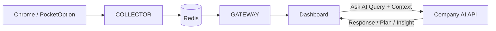

# QuFLX v2 – AI Integration Strategy for the "Ask AI" Feature

**Date:** 2025-12-19  
**Audience:** Product Owner, Engineering, Quant/Trading Research  
**Context:** Follows `reports/report_25-12-19.md` and `reports/implementation_report_25-12-19.md`

---

## 1. Purpose & Vision

The goal of the **Ask AI** feature is to turn QuFLX v2 from a passive analytics dashboard into an **interactive trading assistant** that:

- Understands the **current market context** visible in the dashboard (ticks, candles, indicators, payout assets, session time, etc.).
- Understands the **user’s intent** expressed in natural language.
- Uses a company AI API (LLM or specialized model) to:
  - Explain what is happening in the market.
  - Surface patterns or risks that might not be obvious visually.
  - Suggest next steps (analysis tasks, environment checks, or automated actions).

This document outlines **what we can do** with such an integration, **what capabilities become possible**, and **how this can increase trading edge** when implemented correctly.

---

## 2. High-Level Integration Model

From the perspective of the existing QuFLX v2 pipeline (Collector → Redis → Gateway → Dashboard), the Ask AI feature slots in as an additional service:

### 2.1 Core Flow for "Ask AI"

1. **User clicks "Ask AI"** in the TopBar.
2. Frontend collects:
   - The user prompt (e.g., "Is volatility increasing on AUDNZD_OTC in the last hour?").
   - Structured context from the store:
     - Selected asset, timeframe, current chart window.
     - Recent candles / ticks aggregated in the frontend.
     - Payout assets list and any open automation state.
3. Frontend calls a **backend AI endpoint** (e.g. `POST /api/v1/ai/ask`) that:
   - Validates and normalizes the context payload.
   - Calls the **company AI API** with a suitable prompt + structured data.
   - Returns an AI response plus optional structured suggestions.
4. Frontend renders the result in an **AI panel** or **chat sidebar** and, optionally, offers **quick actions** (e.g. "Filter assets", "Collect history for this window", "Run 92% favorite scan") based on the AI’s suggestions.

This keeps the existing Collector/Redis/Gateway streaming path intact and merely adds an AI "advisor" layer on top.

---

## 3. Types of AI Capabilities for This Use Case

### 3.1 Contextual Explanations of Current Market State

**Goal:** Help the trader understand what the current chart is saying without manually checking every detail.

Examples:

- "Summarize the last 50 candles for AUDNZD_OTC on the 1m timeframe."
- "Explain the current trend and volatility vs. the previous session."
- "What stands out on this chart that I should pay attention to?"

**Implementation Notes:**

- Frontend sends:
  - Down-sampled candle data (e.g. last 50–100 candles)
  - Selected indicators (if available later from the Strategy service)
  - Basic meta info (asset, timeframe, local time, session window)
- AI prompt examples:
  - "Given this OHLC series and timeframe, describe trend, volatility, and any obvious patterns in concise language suitable for an intraday options trader."

**Trading Edge:**

- Speeds up situational awareness: instead of manually scanning patterns, the user can get a quick summary.
- Helps newer traders interpret price action in a structured way.

---

### 3.2 Pattern & Regime Detection

**Goal:** Use AI to describe **market regimes** beyond simple indicators.

Examples:

- "Is the market ranging or trending over the last 200 bars?"
- "Have there been any repeated spike patterns around this session time?"
- "Does the current behavior look like previous high-volatility periods in my history?" (future extension with backend historical data).

**Implementation Notes:**

- Use the same candle/tick context as 3.1, but add higher-level prompts:
  - "Label this segment as trending up/down, ranging, or choppy, and explain why."
  - "Estimate how often candles close near their extremes (suggesting momentum) vs mid-range (suggesting noise/range)."

**Trading Edge:**

- Better session selection: AI can label conditions as favorable/unfavorable for the user’s strategy style.
- Potential to tier sessions: "avoid these hours" / "focus on these windows" based on regime descriptions.

---

### 3.3 Session & Time-of-Day Analysis

**Goal:** Help the trader identify **profitable times to trade** based on volatility, payout, and other features.

Examples (future when more data is in DB):

- "Compare current volatility on AUDNZD_OTC vs the last 10 sessions at this time."
- "Which 1-hour blocks historically had the most favorable conditions for my strategy?"

**Implementation Notes:**

- Backend can query historical candles or tick-derived statistics for a given asset, timeframe and time-of-day window.
- AI receives aggregated stats (not all raw data) and summarizes.

**Trading Edge:**

- More disciplined schedule: trade primarily when conditions historically support the strategy.
- Avoid overtrading in poor conditions.

---

### 3.4 Cross-Asset Scanning & Ranking

**Goal:** Use AI to **prioritize assets** based on current metrics and the trader’s criteria.

Examples:

- "Among all 92% payout assets currently streaming, which ones show the clearest trend?"
- "Rank my payout assets by volatility and clean structure over the last 50 bars."
- "Which assets currently show similar behavior to AUDNZD_OTC last week when I performed well?" (future, with performance data).

**Implementation Notes:**

- Frontend or backend supplies:
  - A list of assets (e.g., `payoutAssets`) with summary stats per asset: recent volatility, direction, change %, maybe a simple pattern label.
- AI prompt instructs the model to **rank** or **cluster** assets and justify.

**Trading Edge:**

- Faster rotation into good setups, rather than staying on a single default asset.
- AI can reduce cognitive load when scanning many symbols.

---

### 3.5 Explanation of Automated Actions & Capabilities

QuFLX v2 already has automation hooks (e.g., favorites selection via capabilities, future pending orders). AI can:

- Explain **what a capability does** in user language:
  - "Explain what the 92% payout asset sweep does and when to use it."
- Suggest **which automation to run next** based on current context:
  - "Should I run the 92% favorites sweep now for OTC assets?"

**Implementation Notes:**

- Backend exposes a small catalog of capabilities with metadata: name, description, inputs, effects.
- AI is instructed to **never execute** a capability by itself but to propose it as a suggestion with an explicit confirmation step.

**Trading Edge:**

- Helps the user understand and safely use complex automations.
- Bridges the gap between configuration-level tools and high-level goals ("I want to find the best assets right now").

---

### 3.6 Risk & Psychology Coaching (Future)

**Goal:** Provide **soft guidance** around discipline and risk management, leveraging the RiskManager app and trading logs.

Examples (requires more data integration):

- "Given my last 20 trades, what recurring mistakes do you see?"
- "Does my current session match my planned risk parameters?"

**Trading Edge:**

- Keeps the trader aligned with their plan, not just the market conditions.

---

## 4. Integration Modes for the Company AI API

### 4.1 Stateless Q&A Mode

**Description:** Each Ask AI request is independent. We send:

- Prompt text.
- Current chart/asset context.

AI responds with a **single answer**. No long-running conversation.

**Pros:**

- Simple to implement; minimal state to manage.
- Easy to cache or deduplicate queries.

**Cons:**

- Limited ability to build multi-step plans.
- Repeats context overhead for each request.

**Fit:** Good for initial rollout: explanations, quick assessments, and one-off suggestions.

---

### 4.2 Stateful Session / Chat Mode

**Description:** Maintain an AI conversation per user or per browsing session.

- Each query includes a conversation ID.
- Backend stores past exchanges and passes them to the API for context.

**Pros:**

- AI can remember user preferences (risk appetite, favorite setups, frequently used assets).
- More natural coaching & multi-step analysis.

**Cons:**

- Requires careful handling of context length and storage.
- Must avoid leaking sensitive data between users.

**Fit:** Good for more advanced coaching, strategy refinement, and multi-step planning (e.g., "Help me design a session plan for today" + follow-ups).

---

### 4.3 Tool-Using / Agentic Mode (Future)

**Description:** AI can be given **tools** (backend HTTP endpoints) to call:

- `GET /api/v1/history/{asset}` – to fetch more detailed history.
- `POST /api/v1/refresh-assets` – to suggest (not execute) asset refreshing.
- Future endpoints for strategy metrics, risk stats, etc.

The AI would produce **plans** like:

1. Query history for the last 200 candles.
2. Compute volatility bands.
3. Suggest time windows.

**Important:** Execution remains **user-driven**. Ask AI proposes, user confirms.

**Pros:**

- Very powerful: AI can orchestrate multiple data sources.
- Reduces manual "click around" work.

**Cons:**

- More engineering complexity.
- Needs strict guardrails to avoid dangerous or unintended actions.

**Fit:** Longer-term roadmap; can use the existing Gateway as the tool surface.

---

## 5. How This Improves Trading Edge (Concrete Examples)

### 5.1 Faster Situational Awareness

- Without AI: The trader visually inspects the chart, ticks, and payout assets and slowly forms a view.
- With Ask AI: In a single question, the trader gets a structured summary: trend, volatility, key levels, and session context.

**Edge:** More time spent on decision-making, less time on manual scanning.

---

### 5.2 Better Session Selection & Avoiding Bad Conditions

- AI can learn to flag conditions that historically correlate with poor performance (e.g., choppy ranges, payout < 88%, low volume periods).
- Over time, prompts can be tuned: "Would my mean-reversion strategy be appropriate right now?" and AI can answer based on chart regime description + simple rules.

**Edge:** Fewer trades taken in poor conditions → improved expectancy.

---

### 5.3 Cross-Asset Opportunity Discovery

- Given live quotes and basic stats, AI can:
  - Suggest 2–3 assets worth watching **now**.
  - Explain why: "Strong directional move, high payout, recent increased volatility."

**Edge:** Systematic asset rotation instead of emotional picking.

---

### 5.4 Continuous Learning & Strategy Feedback

With more historical and performance data integrated (future work):

- AI can identify patterns in **your own trading logs**:
  - "You tend to lose when entering in the last 10 seconds of the candle."
  - "Your win rate is higher when trading during the first half of London session."

**Edge:** Personal edge discovery—insights specific to the trader, not generic advice.

---

## 6. Architectural Considerations & Best Practices

### 6.1 Maintain Clear Boundaries

- **Collector, Redis, Gateway** remain responsible only for **data streaming** and **API endpoints**.
- **AI integration** lives as a **separate service layer** on the Gateway side:
  - `ai_service.py` or `backend/services/ai/main.py` that handles:
    - Prompt construction.
    - Call to the company AI API.
    - Response shaping (text + optional structured suggestions).

This keeps AI concerns from polluting the core data pipeline.

### 6.2 Data Privacy & Compliance

- Carefully decide **what data** goes to the AI:
  - Market data is generally safe.
  - Personal performance logs and account information require anonymization and explicit consent.
- Ensure API keys and secrets are stored securely (env vars, vault), never in the repo.

### 6.3 Latency & UX

- AI requests are slower than local computations.
- Frontend should:
  - Show a loading state for Ask AI responses.
  - Possibly stream partial responses (depending on the API).
  - Allow the user to cancel a long-running request.

### 6.4 Guardrails

- The AI’s output should be **advisory**, not executable by default.
- Never allow AI to place orders or change automation settings directly.
- Consider a small checklist before exposing a new AI capability:
  - Does the AI propose actions that could cause harm if misinterpreted?
  - Does the UI present them as suggestions, not guarantees?

---

## 7. Suggested Next Steps

1. **Define the Ask AI API contract**
   - `POST /api/v1/ai/ask`: `{ prompt, asset, timeframe, recent_candles, recent_ticks_summary, capabilities_catalog }` → `{ answer_text, suggested_actions? }`.
   - Align this with `docs/DATA_CONTRACTS.md` and keep it versioned.

2. **Implement a minimal backend AI service wrapper**
   - One module responsible for calling the company AI API.
   - Centralized error handling and logging.

3. **Build the initial Ask AI frontend flow**
   - Modal or side panel that:
     - Captures the question.
     - Shows the AI response and timestamps.
     - Optionally lists suggested follow-up actions (no auto-execution).

4. **Start with stateless Q&A + context**
   - Deliver value quickly (explanations, simple evaluations) before adding more complex agentic behavior.

5. **Iterate based on real usage**
   - Log anonymized prompts + context (where permitted) to refine prompts.
   - Identify which questions traders actually ask and tune prompts/models accordingly.

With this roadmap, the Ask AI button becomes the entry point into a focused, context-aware trading assistant that is tightly integrated with QuFLX v2’s streaming architecture and data contracts, while still respecting separation of concerns and safety boundaries.
