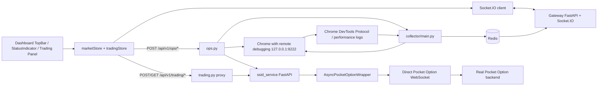
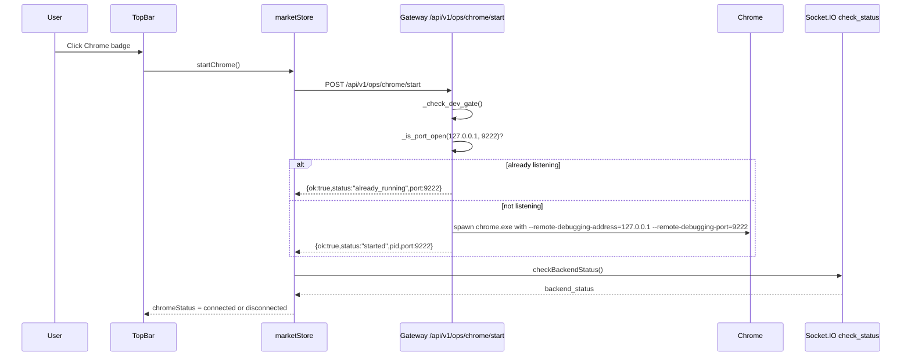
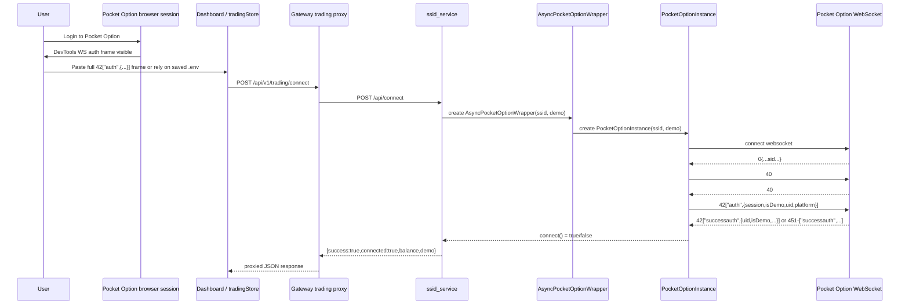

# Chrome, Stream, and SSID Architecture Review

Date: 2026-03-25
Project: QuFLX v2
Review Standard: `.agents/Reviewer.json`

## 1. Scope

This document analyzes the current implementation of:

- TopBar Chrome, Stream, and SSID controls
- Gateway Socket.IO status initialization and backend process orchestration
- SSID session lifecycle and Pocket Option authentication flow
- Chrome remote debugging requirements on port 9222
- Security, testing, and review compliance gaps

It is based on the current repository state and documents actual behavior, including design strengths, risks, and mismatches between UI semantics and backend semantics.

## 2. File Inventory

### Frontend

| File | Responsibility | Notes |
|---|---|---|
| `gui/Dashboard/src/components/TopBar.jsx` | Renders WS, Chrome, Stream, and SSID badges and binds click handlers | Chrome and SSID are process controls; Stream is process control plus health display |
| `gui/Dashboard/src/components/Dashboard.jsx` | Opens and closes the Socket.IO connection on mount/unmount | Starts the status workflow |
| `gui/Dashboard/src/components/StatusIndicator.jsx` | Periodically triggers backend status checks via Socket.IO | Poll cadence is 5 seconds |
| `gui/Dashboard/src/store/marketStore.js` | Owns WebSocket state, Chrome/Stream/SSID action handlers, backend status state, and Socket.IO event listeners | Primary frontend orchestration layer |
| `gui/Dashboard/src/store/tradingStore.js` | Owns SSID connect/disconnect/trade/result/mode-switch requests through Gateway trading proxy | Separate from process-lifecycle state |
| `gui/Dashboard/src/hooks/useStreamHealth.js` | Derives Stream badge state from last tick timestamp | Converts ticks into `idle` / `streaming` / `slow` / `stale` |
| `gui/Dashboard/src/api/apiBase.js` | Resolves API base URL | Defaults to `http://localhost:8000` |

### Gateway

| File | Responsibility | Notes |
|---|---|---|
| `backend/services/gateway/main.py` | FastAPI app bootstrap, Socket.IO app mount, Redis listener, router registration | Origin point for backend process wiring requested in this review |
| `backend/services/gateway/socket_events.py` | Socket.IO event registration and `check_status` status probe | Initializes frontend indicators |
| `backend/services/gateway/routes/ops.py` | Starts/stops Chrome, Collector, and SSID service subprocesses | Local-only/dev-gated orchestration layer |
| `backend/services/gateway/routes/trading.py` | Thin HTTP proxy from Gateway to SSID service | Public trading API used by frontend |

### Collector / Chrome Debugging

| File | Responsibility | Notes |
|---|---|---|
| `backend/services/collector/main.py` | Collector service main loop | Publishes `market_data` and `system_status` to Redis |
| `backend/services/collector/connection.py` | Attaches Selenium to existing Chrome remote debugging session | Hardcoded default port is 9222 |
| `backend/services/collector/interceptor.py` | Reads Chrome performance logs and parses WebSocket frames into ticks/history events | CDP-dependent |
| `backend/services/gateway/asset_control.py` | Browser control path that also attaches to Chrome on 9222 | Part of the same debug-port convention |
| `qf.py` | Utility for attaching to Chrome debug session | Also assumes 9222 |

### SSID Service

| File | Responsibility | Notes |
|---|---|---|
| `backend/services/ssid_service/main.py` | SSID FastAPI bootstrap and in-memory session state initialization | Loads `.env` at startup |
| `backend/services/ssid_service/routes.py` | API endpoints for connect/disconnect/status/trade/result/assets/switch-mode/ssid-status | Main service contract |
| `backend/services/ssid_service/connector.py` | Thread-safe sync wrapper around async Pocket Option WebSocket client | One background event loop per session wrapper |
| `backend/services/ssid_service/executor.py` | Asset normalization and trade/result orchestration | Delegates actual I/O to connector |
| `backend/services/ssid_service/pocketoptionapi/pocket_option_instance.py` | Direct Pocket Option WebSocket protocol implementation | Handles auth, keep-alive, order placement, result lookup |

### Verification / Review Inputs

| File | Responsibility | Notes |
|---|---|---|
| `.agents/Reviewer.json` | Review gate definition | Readability, OWASP/security, maintainability, testing, separation of concerns, fail-fast validation, explicit error handling |
| `backend/tests/test_ops_routes.py` | Ops lifecycle tests | Validates dev gate and Chrome/Stream process control behavior |
| `backend/tests/test_ssid_service.py` | SSID service tests | Validates SSID format rules and endpoint behavior |
| `backend/tests/test_trading_proxy.py` | Gateway trading proxy tests | Validates 503 behavior and upstream error normalization |
| `gui/Dashboard/package.json` | Frontend lint/build scripts | `lint` and `build` available |

## 3. Component Relationship Diagram



## 4. TopBar Chrome Integration Analysis

### 4.1 Initialization Path

The indicator initialization sequence starts when the dashboard mounts:

1. `Dashboard.jsx` calls `connectSocket()` on mount.
2. `marketStore.connectSocket()` creates a Socket.IO client pointed at `getApiBaseUrl()`, which defaults to `http://localhost:8000`.
3. On Socket.IO `connect`, the store:
   - sets `wsStatus = 'connected'`
   - syncs subscriptions
   - publishes monitoring assets
   - emits `check_status`
4. `backend/services/gateway/main.py` has already registered Socket.IO handlers by calling `register_socket_events(sio, redis_client, system_state)` during FastAPI lifespan startup.
5. `socket_events.py` handles `check_status`, probes Redis, probes `127.0.0.1:9222`, probes the SSID service port, and emits `backend_status`.
6. `marketStore` listens for `backend_status` and updates:
   - `chromeStatus`
   - `ssidStatus`
   - `backendStatus.redisConnected`
   - `backendStatus.chromeDebuggingAvailable`
   - `backendStatus.readyForAssets`
7. `TopBar.jsx` renders the badge state, and `StatusIndicator.jsx` continues forcing a `check_status` refresh every 5 seconds.

### 4.2 TopBar Badge Semantics

| Badge | State Source | Click Behavior | What it actually means |
|---|---|---|---|
| WS | `wsStatus` | No click handler | Socket.IO connectivity to Gateway |
| Chrome | `chromeStatus` | `startChrome()` | Whether Gateway currently reports Chrome debug availability |
| Stream | `useStreamHealth()` over `lastTickTimestamp` | `startStream()` or `pauseStream()` | Collector liveness inferred from incoming market ticks, not from subprocess PID alone |
| SSID | `ssidStatus` | `startSsidService()` or `stopSsidService()` | Mostly SSID service process reachability, not guaranteed authenticated Pocket Option session |

### 4.3 Chrome Button Workflow



#### Frontend state handling

- `opsChromeBusy` prevents duplicate clicks.
- Non-2xx responses are parsed for `user_message`, then copied into `lastError`.
- Network exceptions are normalized through `getErrorMessage(err)` and also copied into `lastError`.
- No optimistic `chromeStatus` update occurs; the UI waits for a later `backend_status` refresh.

#### Backend behavior

- `ops.py` enforces:
  - `QFLX_ENABLE_OPS == "1"`
  - local client only
  - optional `QFLX_OPS_TOKEN` header check
- `_spawn_chrome()` launches Chrome with:
  - `--remote-debugging-address=127.0.0.1`
  - `--remote-debugging-port=9222`
  - dedicated `--user-data-dir`
  - several additional insecure convenience flags discussed in the security audit

### 4.4 Stream Button Workflow

The Stream button is a process-control button in the UI but a health-derived badge in the display layer.

#### Click path

1. `TopBar.jsx` computes `health = useStreamHealth()`.
2. If `health === 'streaming'`, clicking runs `pauseStream()`.
3. Otherwise, clicking runs `startStream()`.
4. Each action calls Gateway ops routes:
   - `POST /api/v1/ops/stream/start`
   - `POST /api/v1/ops/stream/pause`
5. On success, the frontend emits `check_status`.

#### Collector start path

1. `ops.py` spawns `backend/services/collector/main.py`.
2. `collector/main.py` creates `ChromeConnectionManager`.
3. `ChromeConnectionManager.connect()` attaches Selenium to `127.0.0.1:9222` using `debuggerAddress`.
4. It enables Chrome performance logs with `goog:loggingPrefs = {"performance": "ALL"}`.
5. `WebSocketInterceptor` reads `Network.webSocketFrameReceived` entries from the performance logs.
6. Parsed tick events are published to Redis channel `market_data`.
7. Gateway `redis_listener()` receives Redis messages and emits `market_data` over Socket.IO.
8. `marketStore` updates `lastTickTimestamp`.
9. `useStreamHealth()` converts `lastTickTimestamp` to:
   - `streaming` if recent under 5 seconds
   - `slow` if under 30 seconds
   - `stale` otherwise

#### Key implication

The Stream badge does not use the collector PID as its final truth source. A running collector process with no incoming ticks can still display `slow` or `stale`.

### 4.5 SSID Button Workflow

The SSID badge mixes service lifecycle and connection lifecycle.

#### Click path

1. `TopBar.jsx` binds:
   - `startSsidService()` when `ssidStatus !== 'connected'`
   - `stopSsidService()` when `ssidStatus === 'connected'`
2. `marketStore.startSsidService()`:
   - sets `opsSsidBusy = true`
   - sets `ssidStatus = 'connecting'`
   - calls `POST /api/v1/ops/ssid/start`
3. The store then polls `GET /api/v1/ops/ssid/status` up to 6 times with 500 ms delay.
4. If the service reports `running = true`, the store attempts auto-connect:
   - dynamically imports `tradingStore`
   - calls `fetchSsidStatus()`
   - uses saved `.env` availability flags
   - calls `tradingStore.connect('', isDemoMode)` to let SSID service use its in-memory `.env` fallback
5. Finally it emits `checkBackendStatus()`.

#### Important semantic mismatch

If the SSID service process is running but no valid SSID was loaded, the frontend still sets:

- `ssidStatus = 'connected'`

In current behavior, this means the badge is closer to “SSID service reachable” than “authenticated Pocket Option account attached”.

### 4.6 Socket.IO Status Initialization Originating from Gateway `main.py`

The initialization origin requested in the task is:

1. `gateway/main.py` starts FastAPI.
2. During lifespan startup it:
   - creates Redis client
   - stores it in `app.state.redis`
   - calls `register_socket_events(...)`
   - starts `redis_listener()`
3. `register_socket_events()` defines `check_status`.
4. `check_status` probes:
   - Redis availability
   - Chrome debug port 9222
   - SSID service port from `QFLX_SSID_SERVICE_PORT`
   - collector state from `system_state`
5. It emits `backend_status`.
6. Frontend stores consume `backend_status` and redraw indicators.

### 4.7 Message Protocols and Error Handling in the TopBar Path

#### Frontend to Gateway

- Protocol: HTTP JSON over `fetch()`
- Endpoints:
  - `POST /api/v1/ops/chrome/start`
  - `POST /api/v1/ops/stream/start`
  - `POST /api/v1/ops/stream/pause`
  - `POST /api/v1/ops/ssid/start`
  - `POST /api/v1/ops/ssid/stop`
  - `GET /api/v1/ops/ssid/status`
- Success shape:
  - `{ ok: true, ... }`
- Error shape:
  - `{ ok: false, error_code, error_message, user_message, details? }`

#### Gateway to Frontend

- Protocol: Socket.IO
- Events used by this flow:
  - `backend_status`
  - `system_status`
  - `market_data`

#### Error handling summary

| Layer | Error handling |
|---|---|
| `marketStore.startChrome/startStream/pauseStream/startSsidService/stopSsidService` | Converts non-2xx and network failures into `lastError` |
| `ops.py` | Returns structured JSON errors instead of raw exceptions |
| `gateway/main.py` | Global exception handlers return JSON with `error_id` and optional debug block |
| `socket_events.py` | Emits `backend_status_error`, but frontend currently has no listener for it |

## 5. SSID Session Management Architecture

## 5.1 High-Level Model

The SSID service is a standalone FastAPI service on port 8001 that maintains two independent Pocket Option session wrappers:

- `app.state.demo_session`
- `app.state.real_session`

It also tracks:

- `app.state.ssid_demo`
- `app.state.ssid_real`
- `app.state.active_mode`
- `app.state.session_lock`

This allows the service to keep separate demo and real browser-auth-derived sessions in memory while exposing one active mode to the frontend.

## 5.2 SSID Connection Protocol

### Actual upstream protocol used by `PocketOptionInstance`

The current implementation speaks directly to Pocket Option’s Socket.IO-style WebSocket endpoint.

#### Region selection

- Demo URLs:
  - `wss://demo-api-eu.po.market/socket.io/?EIO=4&transport=websocket`
  - `wss://try-demo-eu.po.market/socket.io/?EIO=4&transport=websocket`
- Real URLs:
  - `wss://api-eu.po.market/socket.io/?EIO=4&transport=websocket`
  - `wss://api-fi.po.market/socket.io/?EIO=4&transport=websocket`
  - `wss://api-en.po.market/socket.io/?EIO=4&transport=websocket`
  - `wss://api-us-north.po.market/socket.io/?EIO=4&transport=websocket`
  - `wss://api-us-south.po.market/socket.io/?EIO=4&transport=websocket`

#### Handshake sequence



### Concrete auth-frame behavior

`PocketOptionInstance._process_message()` handles the key sequence:

1. Server sends `0...sid...`
2. Client sends `40`
3. Server sends namespace frame `40`
4. Client sends auth payload:
   - exact frame from browser if `self.ssid` already starts with `42["auth"`
   - otherwise a generated payload using the provided raw session string
5. Client waits on `_auth_event`
6. Auth succeeds when either branch receives:
   - `42["successauth", {...}]`
   - `451-["successauth", {...}]`
7. Auth fails when payload contains `NotAuthorized` or when auth times out

### Example accepted SSID shape

```json
42["auth",{"session":"<opaque-session-value>","isDemo":1,"uid":123,"platform":2}]
```

### Validation behavior

`routes.py` validates only:

- type is string
- non-empty
- minimum length
- prefix starts with `42["auth"`
- regex includes `"session"` and `"isDemo"`

The actual identity proof is not validated locally. The service trusts Pocket Option to confirm or reject the session during `successauth`.

## 5.3 Session Initialization and State Management

### Connect flow

1. `POST /api/connect` receives `{ ssid, demo }`.
2. The service chooses:
   - explicit `ssid` if provided
   - otherwise `.env` fallback from `app.state.ssid_demo` or `app.state.ssid_real`
3. It validates format with `validate_ssid_format()`.
4. It acquires `session_lock`.
5. It stops any existing session for that mode.
6. It instantiates `AsyncPocketOptionWrapper`.
7. It calls `session.connect()` in a worker thread.
8. On success:
   - assigns `demo_session` or `real_session`
   - updates `active_mode`
   - fetches balance
9. Outside the lock, it persists the SSID into `.env`.

### Dual-mode behavior

- Demo and real sessions are isolated in separate wrapper instances.
- `switch-mode` can reconnect lazily if no active target-mode wrapper exists but the corresponding `.env` SSID exists.
- Trade execution always uses the currently active mode returned by `_resolve_session()`.

### Trade flow

1. `POST /api/trade` validates asset, direction, amount, expiration.
2. Service confirms active session exists and `is_connected()`.
3. `OTCExecutor.execute_trade()` normalizes asset to Pocket Option format.
4. `AsyncPocketOptionWrapper.buy()` marshals request into the background event loop.
5. `PocketOptionInstance.buy()` sends:

```json
42["openOrder",{"asset":"EURUSD_otc","amount":10,"action":"call","isDemo":1,"requestId":"abcd1234","optionType":100,"time":60}]
```

6. Order responses can arrive as:
   - `42["successopenOrder", ...]`
   - `451-["successopenOrder", ...]`
   - corresponding failure variants
7. `_resolve_pending_trade()` matches by `requestId`, with fallback to first pending request.
8. The API returns `{ success, order_id, asset, direction, amount, expiration }`.

### Result flow

1. `GET /api/result/{order_id}` resolves current active session.
2. `OTCExecutor.check_result()` calls `wrapper.check_win(order_id)`.
3. `PocketOptionInstance.check_win()` scans `closed_deals` for up to 5 seconds.
4. `closed_deals` is populated from:
   - direct JSON arrays of deals
   - dict payloads containing `deals`
   - `updateClosedDeals` follow-up behavior

## 5.4 CDP Integration via the SSID Method

There are two separate but related mechanisms in the system:

### A. Chrome Debugging / CDP path

Used for:

- collector market data interception
- history capture
- browser-attached automation
- manual DevTools inspection used by operators to obtain SSID auth frames

Implementation path:

- Chrome launched with `--remote-debugging-port=9222`
- Selenium attaches with `debuggerAddress`
- Chrome performance logs expose CDP `Network.webSocketFrameReceived`
- collector parses WebSocket frames for market data/history

### B. SSID WebSocket path

Used for:

- authenticated trading session establishment without Selenium

Implementation path:

- operator obtains the `42["auth", ...]` frame from browser DevTools
- frontend or `.env` stores that frame
- SSID service replays the auth frame directly over a new WebSocket connection to Pocket Option

### Exact relationship

The SSID method does not authenticate through CDP. It authenticates by replaying a browser-derived Socket.IO auth payload that is typically harvested through DevTools inspection. CDP is therefore an acquisition and observability channel, not the transport used by the trading session itself.

## 5.5 Authentication Chain Linking Browser Sessions to Real User Accounts

1. A human logs into Pocket Option in a real Chrome browser profile.
2. Pocket Option associates that browser session with the user’s account on its own backend.
3. During WebSocket session establishment, the browser sends an auth frame containing:
   - `session`
   - `isDemo`
   - `uid`
   - `platform`
4. The user copies that full auth frame.
5. QuFLX forwards the same frame to `ssid_service`.
6. `PocketOptionInstance` replays the auth frame against a Pocket Option WebSocket endpoint.
7. Pocket Option returns `successauth` for valid sessions.
8. QuFLX treats `successauth` as authoritative proof that the session belongs to the referenced Pocket Option account.

### Security implication

The local system never independently verifies user identity. It delegates identity validation entirely to Pocket Option’s upstream session acceptance.

## 5.6 API Endpoint Inventory

### Public frontend-facing Gateway endpoints

| Method | Path | Purpose |
|---|---|---|
| POST | `/api/v1/ops/chrome/start` | Start or detect Chrome remote debugging process |
| POST | `/api/v1/ops/stream/start` | Start collector subprocess |
| POST | `/api/v1/ops/stream/pause` | Stop collector subprocess |
| GET | `/api/v1/ops/stream/status` | Report collector process state |
| POST | `/api/v1/ops/ssid/start` | Start SSID service subprocess |
| POST | `/api/v1/ops/ssid/stop` | Stop SSID service subprocess |
| GET | `/api/v1/ops/ssid/status` | Report SSID service process state |
| POST | `/api/v1/trading/connect` | Proxy connect request to SSID service |
| POST | `/api/v1/trading/disconnect` | Proxy disconnect request |
| GET | `/api/v1/trading/status` | Proxy active session status |
| POST | `/api/v1/trading/execute` | Proxy trade execution |
| GET | `/api/v1/trading/result/{order_id}` | Proxy order-result lookup |
| POST | `/api/v1/trading/switch-mode` | Proxy demo/real mode switch |
| GET | `/api/v1/trading/ssid-status` | Proxy `.env` SSID availability booleans |
| GET | `/api/v1/trading/assets` | Proxy assets endpoint |

### Internal SSID service endpoints

| Method | Path | Purpose |
|---|---|---|
| GET | `/health` | Service health |
| POST | `/api/connect` | Connect demo or real session using provided or saved SSID |
| POST | `/api/disconnect` | Disconnect current active session |
| GET | `/api/status` | Report active session connectivity and balance |
| POST | `/api/trade` | Execute trade |
| GET | `/api/result/{order_id}` | Check result |
| GET | `/api/ssid-status` | Return boolean flags for saved demo/real SSIDs |
| GET | `/api/assets` | Placeholder assets endpoint |
| POST | `/api/switch-mode` | Switch active mode and lazily connect fallback session |

## 5.7 Error Handling Matrix

| Operation | Failure Mode | Current behavior |
|---|---|---|
| Start Chrome | Ops disabled / non-local / token mismatch | Structured 403 JSON |
| Start Chrome | Chrome not found | Structured 424 JSON |
| Connect SSID | Missing or malformed SSID | 400 JSON via FastAPI `detail.success = false` |
| Connect SSID | Upstream auth rejected | 401 JSON |
| Connect SSID | Upstream timeout | `connect()` returns false after timeout path |
| Trading proxy | SSID service unreachable | 503 JSON |
| Stream collector | Chrome 9222 missing | collector startup fails; UI sees no stream health |
| Socket check | probe failure | `backend_status_error` emitted, but frontend currently ignores it |

## 6. Why Chrome Must Run in Debug Mode on Port 9222

## 6.1 Technical Requirement

Chrome must run with a remote debugging endpoint because the collector does not automate a fresh browser session; it attaches to an already running Pocket Option browser session.

This is required by:

- `collector/connection.py` using `options.add_experimental_option("debuggerAddress", "127.0.0.1:9222")`
- `gateway/socket_events.py` probing `127.0.0.1:9222`
- `gateway/routes/ops.py` spawning Chrome with `--remote-debugging-port=9222`
- `asset_control.py`, `qf.py`, and several capability scripts that also assume 9222

Without a debug port:

- Selenium cannot attach to the already logged-in browser profile
- the collector cannot access Chrome performance logs
- `Network.webSocketFrameReceived` events are unavailable to the current collector architecture
- operators lose the same DevTools channel they use to inspect or recover SSID auth payloads

## 6.2 Why Specifically Port 9222

Port 9222 is an implementation convention, not a CDP protocol requirement.

The reason it is effectively mandatory today is that multiple repository components hardcode 9222:

- Chrome spawn logic
- Chrome reachability health checks
- collector attachment defaults
- auxiliary browser tooling

### Conclusion

Chrome does not inherently need port 9222, but this codebase currently does.

## 6.3 Alternative Port Configurations

Alternative ports are technically feasible, but not without coordinated changes.

To support a different port safely, the following must be parameterized together:

- `backend/services/gateway/routes/ops.py`
- `backend/services/gateway/socket_events.py`
- `backend/services/collector/connection.py`
- `backend/services/gateway/asset_control.py`
- `qf.py`
- any scripts or docs that attach to `127.0.0.1:9222`

The current codebase does not centralize this into a single environment variable for all consumers.

## 6.4 Security Implications

### Positive control already present

- Chrome is bound to `127.0.0.1` rather than all interfaces.

### Material risks

- `_spawn_chrome()` enables:
  - `--disable-web-security`
  - `--allow-running-insecure-content`
- If a local malicious process can reach the debugging endpoint, it may inspect tabs, cookies, DOM state, and DevTools targets.
- If port forwarding, proxying, or firewall exceptions expose 9222, the attack surface increases sharply.

## 6.5 Performance Considerations

- CDP/performance log collection adds overhead because the collector continuously fetches performance logs and parses all `Network.webSocketFrameReceived` entries.
- `goog:loggingPrefs = {"performance": "ALL"}` is broad and can collect more than the minimum required signal.
- The collector loop sleeps only 100 ms between iterations, which is responsive but potentially noisy on CPU and log volume.

## 7. Code Review Against `.agents/Reviewer.json`

Review categories applied:

- readability
- security / OWASP-style exposure review
- maintainability
- testing
- separation of concerns
- fail-fast validation
- explicit error handling

## 7.1 Strengths

### Low Risk / Positive Findings

1. **Separation of concerns is materially better than a monolith**
   - Gateway handles public API, Socket.IO, and subprocess orchestration.
   - SSID service handles trading-session state.
   - Collector handles CDP market-data interception.

2. **Fail-fast validation exists in the highest-risk entry points**
   - ops dev-gate checks reject unsupported access early.
   - SSID format checks reject malformed auth payloads before network I/O.
   - trade request models enforce positive amount and expiration.

3. **Error responses are mostly structured**
   - ops routes return explicit error envelopes.
   - FastAPI exception handlers in Gateway and SSID service prevent raw HTML tracebacks.
   - trading proxy normalizes upstream error shapes.

4. **Test coverage exists on critical service boundaries**
   - ops route behavior is covered
   - SSID validation behavior is covered
   - trading proxy unavailability and error normalization are covered

## 7.2 Issues

### High Severity

1. **Chrome is launched with insecure browser flags**
   - Evidence: `_spawn_chrome()` adds `--disable-web-security` and `--allow-running-insecure-content`.
   - Risk: weakens same-origin and mixed-content protections in the debug browser profile.
   - Reviewer gate impact: security / OWASP.

2. **TopBar ops controls are incompatible with `QFLX_OPS_TOKEN` enforcement**
   - Evidence: frontend fetch calls do not send `X-QFLX-OPS-TOKEN`, while ops routes require it when configured.
   - Risk: enabling the recommended token blocks Chrome/Stream/SSID controls.
   - Reviewer gate impact: maintainability, predictable operation.

3. **Socket.IO and HTTP CORS are effectively open**
   - Evidence: Gateway uses `allow_origins=["*"]`, `allow_headers=["*"]`, and Socket.IO `cors_allowed_origins='*'`.
   - Risk: broad browser-origin access surface, especially in development environments with sensitive local services.
   - Reviewer gate impact: security / OWASP.

4. **PocketOptionInstance disables TLS certificate verification**
   - Evidence: `ssl_context.check_hostname = False` and `ssl_context.verify_mode = ssl.CERT_NONE`.
   - Risk: removes normal TLS trust validation for upstream trading WebSocket sessions.
   - Reviewer gate impact: security / OWASP.

### Medium Severity

5. **SSID badge semantics do not match authenticated-session semantics**
   - Evidence: `ssidStatus` becomes `connected` when the SSID service process is running, even without a successful Pocket Option login.
   - Risk: operators can misinterpret “service up” as “real trading session authenticated”.
   - Reviewer gate impact: readability, predictability.

6. **The running SSID service does not refresh in-memory `.env` booleans after persistence**
   - Evidence: `_persist_ssid()` writes `.env`, but `ssid_status()` reads startup-loaded `app.state.ssid_demo` and `app.state.ssid_real`.
   - Risk: `fetchSsidStatus()` can be stale until service restart.
   - Reviewer gate impact: maintainability, predictable state.

7. **Chrome availability is partially conflated with collector availability**
   - Evidence: `check_status()` reports `chrome_debugging_available = chrome_status or collector_connected`.
   - Risk: status can claim Chrome-ready even when the debug port itself is gone.
   - Reviewer gate impact: fail-fast validation, observability accuracy.

8. **`backend_status_error` is emitted but not consumed**
   - Evidence: frontend has no listener for `backend_status_error`.
   - Risk: status-probe failures can disappear from UI feedback.
   - Reviewer gate impact: explicit error handling.

### Principle Violations Requiring Explicit Wording

9. **Principle #8 violation candidate**
   - `tradingStore.fetchSsidStatus()` intentionally suppresses failure into debug logging only.
   - Required wording: `Defensive & Explicit Error Handling — never swallow errors, never silent failures.`

10. **Principle #9 violation candidate**
   - SSID badge status can report success before account authentication has actually been confirmed.
   - Required wording: `Fail Fast, Fail Loud, Fail Predictably — validate inputs early, use proper error boundaries.`

## 7.3 Suggested Fixes for `@Coder`

1. Parameterize the Chrome debug port into a single shared config source and consume it in ops, gateway status checks, collector, and tooling.
2. Remove `--disable-web-security` and `--allow-running-insecure-content` from the normal Chrome launch path unless a separate explicitly unsafe mode is enabled.
3. Add optional frontend support for sending `X-QFLX-OPS-TOKEN` on ops requests when configured locally.
4. Split SSID process status from SSID authentication status in the UI and backend status payload.
5. Refresh `app.state.ssid_demo` / `app.state.ssid_real` after `_persist_ssid()` succeeds.
6. Add a frontend listener for `backend_status_error` and surface it in `lastError`.
7. Re-enable TLS verification for Pocket Option WebSocket connections unless a verified compatibility reason requires the current behavior.

## 7.4 Reviewer Checklist

| Review Area | Pass | Notes |
|---|---|---|
| Readability | Partial | Core flows are readable, but SSID badge semantics are misleading |
| Security (OWASP) | Fail | Insecure Chrome flags, open CORS, optional unauthenticated Socket.IO, TLS verification disabled |
| Maintainability | Partial | Strong service split, but debug-port hardcoding is widespread |
| Testing | Partial | Good targeted tests, no visible end-to-end test covering full Chrome → Stream → SSID chain |
| Separation of Concerns | Pass | Gateway, collector, and SSID service are separated |
| Fail-fast validation | Partial | Good request validation, but some status semantics are overly optimistic |
| Explicit error handling | Partial | Most HTTP paths are explicit; some UI/status paths still suppress or blur failures |

## 8. Testing Procedures

## 8.1 Automated Verification

### Backend

```powershell
conda run -n QuFLX-v2 python -m pytest backend/tests/test_ops_routes.py backend/tests/test_ssid_service.py backend/tests/test_trading_proxy.py -v
```

### Frontend

```powershell
cd gui\Dashboard
npm run lint
```

Optional build validation:

```powershell
cd gui\Dashboard
npm run build
```

## 8.2 Manual Process Validation

### Chrome start validation

1. Ensure `QFLX_ENABLE_OPS=1`.
2. Open Dashboard.
3. Click `Chrome`.
4. Confirm:
   - response is success
   - `check_status` updates `chromeStatus`
   - local port 9222 is listening
   - Chrome opened using the dedicated profile directory

### Stream validation

1. Start Chrome first.
2. Click `Stream`.
3. Confirm:
   - collector process is spawned
   - Redis receives `system_status` with `collector = connected`
   - `market_data` begins arriving
   - `useStreamHealth()` changes badge to `streaming`

### SSID service validation

1. Click `SSID`.
2. Confirm `POST /api/v1/ops/ssid/start` succeeds.
3. Confirm `GET /api/v1/ops/ssid/status` reports `running = true`.
4. If `.env` contains a valid saved SSID:
   - confirm auto-connect succeeds
   - confirm `/api/v1/trading/status` returns `connected = true`
5. If no SSID exists:
   - confirm badge behavior is understood as service-up only
   - manually connect from trading UI using a pasted auth frame

### Real-account authentication validation

1. Log into Pocket Option in Chrome manually.
2. Capture the full `42["auth", ...]` frame from DevTools Network WebSocket traffic.
3. Connect through the trading UI with `demo = false`.
4. Confirm:
   - `successauth` is accepted
   - `/api/v1/trading/status` returns `connected = true`
   - `balance` matches the expected real account

## 9. Security Audit Report for Chrome Debugging

| Finding | Severity | Evidence | Impact | Recommended Action |
|---|---|---|---|---|
| Debug endpoint exposed on a known fixed port | Medium | `--remote-debugging-port=9222` and hardcoded probes | Predictable local attack target | Parameterize port and document firewall expectations |
| Debug endpoint bound to localhost | Positive | `--remote-debugging-address=127.0.0.1` | Limits remote network exposure | Keep this binding mandatory |
| Browser security weakened by launch flags | High | `--disable-web-security`, `--allow-running-insecure-content` | Elevated browser compromise risk | Remove in default path |
| CDP logs collect broad performance telemetry | Medium | `goog:loggingPrefs = {"performance": "ALL"}` | Extra CPU/log overhead, more data exposed locally | Narrow collection if feasible |
| DevTools session can expose sensitive user context | High | Debugging browser contains authenticated Pocket Option session | Local compromise can inspect tabs, DOM, storage | Use dedicated local-only profile, least-privilege workstation hygiene |
| SSID secrets persisted in plaintext `.env` | Medium | `_persist_ssid()` writes raw frame to `.env` | Local credential theft risk | Prefer encrypted secret storage or local vault integration |
| TLS verification disabled for upstream PO WebSocket | High | `CERT_NONE` | MITM risk on trading-session traffic | Restore certificate validation |

## 10. Data Flow Summary

## 10.1 Chrome + Stream data path

```mermaid
flowchart LR
    A[TopBar Stream click] --> B[Gateway ops /stream/start]
    B --> C[collector/main.py]
    C --> D[Attach Selenium to 127.0.0.1:9222]
    D --> E[Read CDP performance logs]
    E --> F[Parse WebSocket frames]
    F --> G[Publish Redis market_data]
    G --> H[Gateway redis_listener]
    H --> I[Socket.IO market_data]
    I --> J[marketStore lastTickTimestamp]
    J --> K[useStreamHealth]
    K --> L[TopBar Stream badge]
```



## 10.2 SSID auth path

```mermaid
flowchart LR
    A[Browser login on Pocket Option] --> B[DevTools WebSocket auth frame]
    B --> C[User paste or saved .env]
    C --> D[Dashboard tradingStore.connect]
    D --> E[Gateway trading proxy]
    E --> F[ssid_service /api/connect]
    F --> G[AsyncPocketOptionWrapper]
    G --> H[PocketOptionInstance.connect]
    H --> I[Upstream Pocket Option WebSocket]
    I --> J[successauth / updateBalance]
    J --> K[SSID service session state]
    K --> L[Gateway proxy response]
    L --> M[Trading UI balance / connected state]
```



## 11. Bottom-Line Assessment

The architecture is directionally strong because it separates:

- browser-attached market-data collection
- public gateway concerns
- SSID trading-session concerns

The most important current risks are:

1. Chrome debugging security posture is too permissive for a default path.
2. The SSID badge overstates authentication state.
3. The ops-token security gate is not wired through the frontend.
4. The 9222 dependency is real in implementation but not centralized in configuration.

Those issues do not invalidate the architecture, but they are the main blockers to calling the workflow production-hardened.
