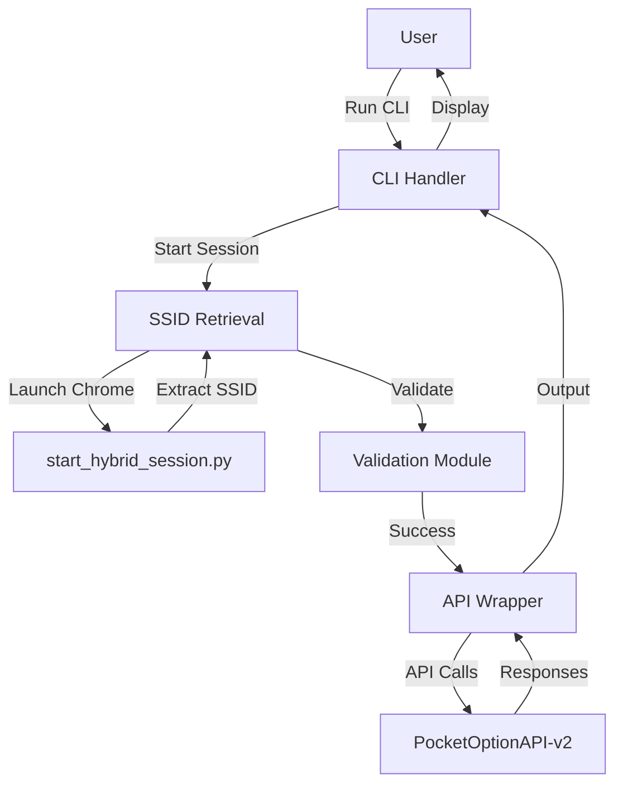

# Test SSID Capabilities CLI Architecture

## Overview
- **Purpose**: A simple command-line interface (CLI) to test Pocket Option API capabilities using SSID authentication, with a focus on asset selection and basic trading operations.
- **Key Requirements**:
  - Integrate with `start_hybrid_session.py` to launch Chrome and retrieve SSID.
  - Validate SSID string format and authentication.
  - Provide commands to list available assets, select assets, and perform test operations.
  - Support both demo and real accounts.
  - Handle errors gracefully and provide clear output.
- **Constraints**:
  - Must use the installed PocketOptionAPI-v2 library.
  - CLI should be lightweight, using standard Python libraries (e.g., argparse).
  - No GUI; pure command-line interaction.
  - Ensure secure handling of SSID (no persistent storage without encryption).
- **Trade-offs**:
  - Simplicity vs. Features: Prioritize core testing functions over advanced error recovery to keep the CLI minimal.
  - Synchronous vs. Asynchronous: Use synchronous calls for simplicity, as the CLI doesn't require real-time streaming initially.
  - Patterns: MVC-like structure for CLI (Model: API interactions, View: Console output, Controller: Command handlers).

## Components
- **SSID Retrieval Module**: Interfaces with `start_hybrid_session.py` to start Chrome and extract SSID.
- **Validation Module**: Checks SSID format and tests API authentication.
- **API Wrapper**: Thin layer around PocketOptionAPI-v2 for asset listing, selection, and testing.
- **CLI Handler**: Uses argparse to manage commands like `list-assets`, `select-asset`, `test-trade`.
- **Error Handler**: Centralized logging and user-friendly error messages.

## Data Flows

## Risks and Mitigations
- **Risk**: SSID extraction fails due to browser changes.
  - **Mitigation**: Provide manual SSID input option and clear instructions for extraction.
- **Risk**: API rate limiting or authentication issues.
  - **Mitigation**: Implement retry logic with exponential backoff and demo mode fallback.
- **Risk**: Security exposure of SSID.
  - **Mitigation**: Never store SSID persistently; use in-memory only and advise users on secure handling.
- **Risk**: Dependency on external library changes.
  - **Mitigation**: Pin library version and provide update instructions.

## Validation
- Test SSID validation with known good/bad formats.
- Verify asset listing returns expected data.
- Ensure CLI commands handle errors without crashing.
- Confirm integration with `start_hybrid_session.py` works end-to-end.

@Engineer: Proceed with implementation details based on this design.
