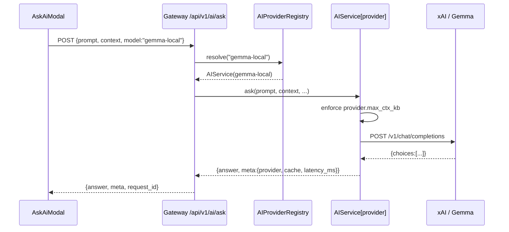

# AI Multi-Model Routing — Implementation Plan
**File:** `v2_Dev_Docs/AI_Model_Routing/AI_Multi_Model_Routing_Plan_26-04-17.md`
**Date:** 2026-04-17
**Authors:** 🏰 @Architect · ⚙️ @Engineer · 👀 @Reviewer
**Status:** 📝 Plan — Awaiting user approval
**Supersedes:** N/A (new subsystem)
**Related:**
- `ai_dev_docs/Gemma4_Local_Trading_Impact_Assessment_26-04-16.md`
- `docs/RUNNING llama server and GEMMA 4.txt`
- `ai_dev_docs/AI_Backend_Indicator_Awareness_Fix_Plan_26-04-14.md`

---

## 0. Executive Summary

QuFLX v2 currently runs a **single** AI model (from `AI_MODEL` env var) for every use case — Ask AI Modal, AI Insights Panel, and Alert Dispatcher all share one configuration. With Gemma 4 E2B verified running locally (`http://127.0.0.1:8080`) and xAI Grok 4 / Grok 4 Fast available in the cloud, we now want **per-use-case model routing** with **user-selectable overrides** (IDE-style model selector in the two interactive panels, and a Settings entry for the Alert Dispatcher).

**Target routing defaults:**

| Use Case | Default | Why | Alt choices |
|---|---|---|---|
| **Ask AI Modal** | Grok 4.1 Fast | speed (TTFT <1s), vision, cache | Gemma local, Grok 4 |
| **AI Insights Panel** | Grok 4 (thinking) | deepest reasoning, xAI voice | Grok Fast, Gemma local |
| **Alert Dispatcher** | Grok 4.1 Fast | high throughput, vision, cache | Gemma local (post-validation) |

**Voice / Conversation layer stays orthogonal.** xAI Realtime (`wss://api.x.ai/v1/realtime`) is independent of the chat completions model. Browser STT/TTS and conversation history are model-agnostic. Only the **"xAI Server Natural Voice" read-back mode** requires a Grok model; Gemma users gracefully fall back to Browser TTS.

**Gemma lifecycle:** QuFLX will **auto-start** `llama-server.exe` on Gateway boot and **gracefully stop** it on shutdown (managed subprocess, no external manual launch required).

**Estimated effort:** ~2.5 working days total (backend 1d, frontend 1d, validation 0.5d).

---

## 1. Architecture Context

### 1.1 Current state

```
┌─────────────────────────┐
│ Gateway (FastAPI)       │
│  ├─ AIService (singleton)│  ← reads AI_MODEL / AI_BASE_URL once
│  ├─ /api/v1/ai/ask      │  → forwards to AIService.ask(...)
│  └─ /api/v1/ai/voice/...│  → WS proxy to xAI realtime (model-agnostic)
└─────────────────────────┘
         │
         ▼
    xAI Grok API (or any OpenAI-compatible endpoint)
```
- `backend/services/ai/service.py` reads `AI_MODEL`, `AI_BASE_URL`, `AI_API_KEY` once at init.
- `backend/services/gateway/main.py` does `ai_service = AIService()` as a module-level singleton + lifespan `await ai_service.close()`.
- `backend/services/gateway/routes/ai.py` has `_get_ai_service()` (`lru_cache`) — not a true singleton but same effect.
- Alert Dispatcher (`backend/scripts/otc_alert_dispatch.py`) is a **separate Python process** with its own `AIService()` instance reading the same env vars.

### 1.2 Target state

```
┌───────────────────────────────────────────────────────┐
│ Gateway (FastAPI)                                     │
│  ├─ LocalAIProcessManager  (NEW)                      │
│  │     └─ supervises llama-server.exe (Gemma)         │
│  ├─ AIProviderRegistry     (NEW)                      │
│  │     ├─ provider "grok-4"       → xAI thinking     │
│  │     ├─ provider "grok-4-fast"  → xAI fast         │
│  │     └─ provider "gemma-local"  → 127.0.0.1:8080   │
│  ├─ AIService(provider_key)  (REFACTORED)             │
│  │     → one client per provider, pooled              │
│  ├─ /api/v1/ai/ask          (accepts model field)     │
│  ├─ /api/v1/ai/providers    (NEW health endpoint)     │
│  └─ /api/v1/ai/voice/...    (unchanged)               │
└───────────────────────────────────────────────────────┘
                         │
         ┌───────────────┼────────────────┐
         ▼               ▼                ▼
     xAI Grok 4     xAI Grok 4 Fast   llama-server.exe
                                      (local Gemma 4)
```

### 1.3 Sequence: Ask AI request with explicit model



---

## 2. Current State Map

| Surface | File | Current Behavior | Target Behavior |
|---|---|---|---|
| AI Service class | `backend/services/ai/service.py` | Single-model singleton, env-driven | Accepts `provider_key`; registry creates per-provider instances |
| Gateway AI DI | `backend/services/gateway/routes/ai.py` (L68-70) | `_get_ai_service()` returns one AIService | `_resolve_ai_service(provider_key)` returns instance from registry |
| Lifespan | `backend/services/gateway/main.py` | Creates 1 AIService, closes on shutdown | Starts LocalAIProcessManager → populates AIProviderRegistry → closes all on shutdown |
| Request schema | `routes/ai.py` `AiAskRequest` | No `model` field | Adds `model: Optional[str]` with whitelist validator |
| Context size guard | `routes/ai.py` validator | Rejects >150KB blindly | Provider-aware limit (Gemma ~24KB, Grok ~150KB) |
| Health discovery | N/A | None | `GET /api/v1/ai/providers` returns `[{key,label,available,capabilities}]` |
| Voice routing | `useNaturalVoice.js` + `ai_voice` route | Always hits xAI realtime | Unchanged; but Settings Panel greys out "Server Voice" when default model = gemma-local |
| Settings store | `gui/.../store/settingsStore.js` | `settings.ai.{voice,verbosity,...}` | Adds `settings.ai.defaultModel`, `settings.ai.alertDispatchModel` |
| AskAi Modal header | `AskAiModal.jsx` | No model chip | Dropdown chip (Gemma / Grok Fast / Grok 4) |
| Insights Panel header | `AiInsightsPanel.jsx` | No model chip | Dropdown chip |
| Settings Panel → AI | `SettingsPanel.jsx` | Voice only | Adds "AI Model" + "Alert Dispatcher Model" selects |
| Alert Dispatcher | `backend/scripts/otc_alert_dispatch.py` | `AIService()` reads env | Reads `QFLX_ALERT_AI_MODEL` env injected by Gateway from settings |
| `.env` | `.env` | `AI_BASE_URL=http://127.0.0.1:8080/v1` ❌ wrong path | See Phase 0 — adjusted + optional per-provider keys |

⚠️ **Important `.env` correction needed:** Current `AIService.base_url` is used as the **full URL** (the code does `POST self.base_url` not `POST {base_url}/chat/completions`). So `http://127.0.0.1:8080/v1` would 404.

**Two valid ways to fix — we will pick Option B in the refactor:**
- **Option A (quick):** Set `AI_BASE_URL=http://127.0.0.1:8080/v1/chat/completions` (works today, no code change).
- **Option B (clean, chosen):** Refactor `AIService` to treat `base_url` as the **root** (`http://127.0.0.1:8080/v1`) and append `/chat/completions` in `ask()`. This aligns with OpenAI SDK conventions and `/api/v1/ai/providers` health check (`GET {base_url}/models`).

---

## 3. Implementation Phases

### ── Phase 0 — `.env` Harmonization & Pre-flight Verification (5 min)

**Goal:** Confirm Gemma is reachable and `.env` is consistent with Option B.

**Tasks:**
1. [ ] Update `.env`:
   ```env
   # Default model (used by Ask AI Modal unless overridden per-request)
   AI_MODEL=gemma-4-2b-it-Q4_0

   # xAI Cloud (Grok) credentials — leave blank to disable cloud providers
   GROK_API_KEY=sk-...

   # Local Gemma (optional; defaults to http://127.0.0.1:8080/v1)
   LOCAL_AI_BASE_URL=http://127.0.0.1:8080/v1
   LOCAL_AI_MODEL=gemma-4-2b-it-Q4_0

   # Local llama-server auto-start (lifecycle-managed by Gateway)
   QFLX_LOCAL_AI_AUTOSTART=1
   QFLX_LOCAL_AI_EXE=C:/Ai_Local/Gemma4-frontuse/llama-b8816-bin-win-cpu-x64/llama-server.exe
   QFLX_LOCAL_AI_MODEL_PATH=C:/Ai_Local/Gemma4-frontuse/models/gemma-4-E2B-it-Q4_K_M.gguf
   QFLX_LOCAL_AI_PORT=8080
   QFLX_LOCAL_AI_THREADS=8

   # Alert Dispatcher — default model (overridable in Settings UI)
   QFLX_ALERT_AI_MODEL=grok-4-fast
   ```
   > Remove the old `AI_BASE_URL` line entirely — it is replaced by provider-specific URLs.
2. [ ] Manual sanity check:
   ```powershell
   conda activate QuFLX-v2
   curl http://127.0.0.1:8080/v1/models
   ```
   Expect JSON with one model entry matching `gemma-4-2b-it-Q4_0`.

**Verification:** curl returns 200 + JSON.

---

### ── Phase 1 — Backend Provider Registry & AIService Refactor (~4 h)

**Goal:** Replace the single-model `AIService` with a provider registry. **This is a rewrite, not a patch** (Core Principle #7 — more than 2 conditional hacks would be needed otherwise).

#### 1.1 New file: `backend/services/ai/providers.py`
```python
from dataclasses import dataclass
from typing import Dict, Optional
import os

@dataclass(frozen=True)
class ProviderSpec:
    key: str
    label: str
    base_url: str            # e.g. "https://api.x.ai/v1"
    api_key_env: Optional[str]  # None = no auth (local)
    model: str
    supports_voice_server: bool  # xAI Realtime compatible
    supports_vision: bool
    max_ctx_kb: int          # safety cap on serialized context
    is_local: bool

def _env(key: str, default: str = "") -> str:
    return os.getenv(key, default)

def build_provider_specs() -> Dict[str, ProviderSpec]:
    return {
        "grok-4": ProviderSpec(
            key="grok-4",
            label="Grok 4 (Thinking)",
            base_url=_env("XAI_BASE_URL", "https://api.x.ai/v1"),
            api_key_env="GROK_API_KEY",
            model="grok-4-latest",
            supports_voice_server=True,
            supports_vision=True,
            max_ctx_kb=150,
            is_local=False,
        ),
        "grok-4-fast": ProviderSpec(
            key="grok-4-fast",
            label="Grok 4.1 Fast",
            base_url=_env("XAI_BASE_URL", "https://api.x.ai/v1"),
            api_key_env="GROK_API_KEY",
            model="grok-4-fast-latest",
            supports_voice_server=True,
            supports_vision=True,
            max_ctx_kb=150,
            is_local=False,
        ),
        "gemma-local": ProviderSpec(
            key="gemma-local",
            label="Gemma 4 E2B (Local)",
            base_url=_env("LOCAL_AI_BASE_URL", "http://127.0.0.1:8080/v1"),
            api_key_env=None,
            model=_env("LOCAL_AI_MODEL", "gemma-4-2b-it-Q4_0"),
            supports_voice_server=False,
            supports_vision=True,
            max_ctx_kb=24,
            is_local=True,
        ),
    }
```

#### 1.2 Refactor: `backend/services/ai/service.py`
- `__init__(self, spec: ProviderSpec)` — builds the `httpx.AsyncClient` from spec
- Remove env reads (moved to `providers.py`)
- **Chat URL = `f"{spec.base_url}/chat/completions"`** (Option B)
- New method `probe()` → `GET {base_url}/models` with 2s timeout → bool
- `ask(...)` stays largely identical but receives `spec.model` instead of `self.model`
- No `x-grok-conv-id` header for local providers (only if `spec.is_local is False`)

```python
class AIService:
    def __init__(self, spec: ProviderSpec) -> None:
        self.spec = spec
        self.api_key = os.getenv(spec.api_key_env) if spec.api_key_env else None
        self._enabled = bool(self.api_key) or spec.is_local
        self._client = None
        if self._enabled:
            headers = {"Content-Type": "application/json"}
            if self.api_key:
                headers["Authorization"] = f"Bearer {self.api_key}"
            self._client = httpx.AsyncClient(
                timeout=httpx.Timeout(self.timeout_seconds_slow, connect=10.0),
                limits=httpx.Limits(max_keepalive_connections=10, max_connections=50),
                headers=headers,
            )

    @property
    def chat_url(self) -> str:
        return f"{self.spec.base_url.rstrip('/')}/chat/completions"

    async def probe(self) -> bool:
        try:
            async with httpx.AsyncClient(timeout=2.0) as c:
                r = await c.get(f"{self.spec.base_url}/models", headers=self._client.headers if self._client else None)
                return r.status_code == 200
        except Exception:
            return False
```

#### 1.3 New file: `backend/services/ai/registry.py`
```python
from typing import Dict, Optional
import logging
from .providers import build_provider_specs, ProviderSpec
from .service import AIService

logger = logging.getLogger("AIRegistry")

class AIProviderRegistry:
    def __init__(self) -> None:
        self._specs = build_provider_specs()
        self._services: Dict[str, AIService] = {k: AIService(s) for k, s in self._specs.items()}

    @property
    def specs(self) -> Dict[str, ProviderSpec]:
        return self._specs

    def get(self, key: str) -> AIService:
        if key not in self._services:
            raise KeyError(f"Unknown AI provider: {key!r}")
        svc = self._services[key]
        if not svc._enabled:
            raise RuntimeError(f"Provider {key!r} is not enabled (missing credentials or disabled)")
        return svc

    def resolve_default(self, ui_context: str) -> str:
        """Return default provider for a UI context: 'modal' | 'insights' | 'alerts'."""
        # These can be overridden via Settings; for now hardcode sane defaults.
        return {
            "modal":    "grok-4-fast",
            "insights": "grok-4",
            "alerts":   os.getenv("QFLX_ALERT_AI_MODEL", "grok-4-fast"),
        }.get(ui_context, "grok-4-fast")

    async def probe_all(self) -> Dict[str, bool]:
        import asyncio
        keys = list(self._services.keys())
        results = await asyncio.gather(*[self._services[k].probe() for k in keys], return_exceptions=True)
        return {k: bool(r) if isinstance(r, bool) else False for k, r in zip(keys, results)}

    async def close_all(self) -> None:
        for svc in self._services.values():
            await svc.close()
```

#### 1.4 New file: `backend/services/ai/local_process.py` (lifecycle manager)
```python
import asyncio
import logging
import os
import subprocess
from typing import Optional

logger = logging.getLogger("LocalAIProcessManager")

class LocalAIProcessManager:
    """
    Supervises the local llama-server.exe process that hosts Gemma.
    - Starts on Gateway lifespan startup (if QFLX_LOCAL_AI_AUTOSTART=1).
    - Terminates on shutdown.
    - Performs readiness check before declaring started.
    """
    def __init__(self) -> None:
        self.enabled = os.getenv("QFLX_LOCAL_AI_AUTOSTART", "0") == "1"
        self.exe = os.getenv("QFLX_LOCAL_AI_EXE", "")
        self.model_path = os.getenv("QFLX_LOCAL_AI_MODEL_PATH", "")
        self.port = int(os.getenv("QFLX_LOCAL_AI_PORT", "8080"))
        self.threads = int(os.getenv("QFLX_LOCAL_AI_THREADS", "8"))
        self.host = os.getenv("QFLX_LOCAL_AI_HOST", "127.0.0.1")
        self._proc: Optional[subprocess.Popen] = None

    async def start(self) -> bool:
        if not self.enabled:
            logger.info("LocalAIProcessManager disabled (QFLX_LOCAL_AI_AUTOSTART != 1)")
            return False
        if not self.exe or not self.model_path:
            logger.warning("LocalAIProcessManager misconfigured — missing EXE or MODEL_PATH")
            return False
        if not os.path.isfile(self.exe):
            logger.error("llama-server.exe not found at %s", self.exe)
            return False
        if not os.path.isfile(self.model_path):
            logger.error("Gemma model file not found at %s", self.model_path)
            return False

        cmd = [
            self.exe,
            "-m", self.model_path,
            "--host", self.host,
            "--port", str(self.port),
            "--threads", str(self.threads),
            "--no-warmup",
        ]
        logger.info("Starting local AI subprocess: %s", " ".join(cmd))
        # CREATE_NEW_PROCESS_GROUP on Windows so we can Ctrl+Break later.
        creationflags = 0
        if os.name == "nt":
            creationflags = subprocess.CREATE_NEW_PROCESS_GROUP  # type: ignore
        self._proc = subprocess.Popen(
            cmd,
            stdout=subprocess.DEVNULL,
            stderr=subprocess.DEVNULL,
            creationflags=creationflags,
        )
        ok = await self._wait_ready(timeout=60.0)
        if not ok:
            logger.error("Local AI failed to become ready within timeout; terminating.")
            await self.stop()
            return False
        logger.info("Local AI subprocess ready on %s:%s (pid=%s)", self.host, self.port, self._proc.pid)
        return True

    async def _wait_ready(self, timeout: float) -> bool:
        import httpx
        deadline = asyncio.get_event_loop().time() + timeout
        url = f"http://{self.host}:{self.port}/v1/models"
        while asyncio.get_event_loop().time() < deadline:
            try:
                async with httpx.AsyncClient(timeout=1.5) as c:
                    r = await c.get(url)
                    if r.status_code == 200:
                        return True
            except Exception:
                pass
            await asyncio.sleep(1.0)
        return False

    async def stop(self) -> None:
        if not self._proc:
            return
        logger.info("Stopping local AI subprocess (pid=%s)", self._proc.pid)
        try:
            self._proc.terminate()
            try:
                self._proc.wait(timeout=5.0)
            except subprocess.TimeoutExpired:
                self._proc.kill()
        except Exception as exc:
            logger.warning("Error stopping local AI subprocess: %s", exc)
        finally:
            self._proc = None
```

#### 1.5 Update: `backend/services/gateway/main.py`
```python
from backend.services.ai.registry import AIProviderRegistry
from backend.services.ai.local_process import LocalAIProcessManager

local_ai = LocalAIProcessManager()
ai_registry: AIProviderRegistry | None = None

@asynccontextmanager
async def lifespan(app: FastAPI):
    global redis_client, ai_registry
    # Start local AI (Gemma) BEFORE registry probes
    await local_ai.start()
    ai_registry = AIProviderRegistry()
    app.state.ai_registry = ai_registry
    # ... existing Redis / socketio setup unchanged ...
    yield
    logger.info("Shutting down API Gateway...")
    if ai_registry:
        await ai_registry.close_all()
    await local_ai.stop()
    if redis_client:
        await redis_client.close()
```

#### 1.6 Update: `backend/services/gateway/routes/ai.py`

- Add field to `AiAskRequest`:
  ```python
  model: Optional[str] = Field(default=None, max_length=64, alias="model")

  @validator("model", pre=True)
  def _validate_model(cls, v):
      if v is None or v == "":
          return None
      s = str(v).strip().lower()
      if s not in {"grok-4", "grok-4-fast", "gemma-local"}:
          raise ValueError(f"unknown model: {v}")
      return s
  ```
- Replace `_get_ai_service()` + `Depends` with `_resolve_ai_service(request, parsed.model)`:
  ```python
  def _resolve_ai_service(request: Request, model_key: Optional[str]) -> AIService:
      registry: AIProviderRegistry = request.app.state.ai_registry
      key = model_key or registry.resolve_default(ui_context="modal")
      return registry.get(key)
  ```
- Enforce provider-aware context size:
  ```python
  ctx_bytes = len(json.dumps(context, separators=(',', ':')).encode('utf-8'))
  max_bytes = service.spec.max_ctx_kb * 1024
  if ctx_bytes > max_bytes:
      raise AIServiceError(
          code="context_too_large",
          user_message=f"Context ({ctx_bytes//1024}KB) exceeds {service.spec.label} limit ({service.spec.max_ctx_kb}KB).",
          status_code=413, retryable=False,
      )
  ```
- New endpoint:
  ```python
  @router.get("/providers")
  async def list_providers(request: Request):
      reg: AIProviderRegistry = request.app.state.ai_registry
      available = await reg.probe_all()
      return {
          "providers": [
              {
                  "key": s.key,
                  "label": s.label,
                  "available": available.get(s.key, False),
                  "capabilities": {
                      "vision": s.supports_vision,
                      "voice_server": s.supports_voice_server,
                      "is_local": s.is_local,
                      "max_ctx_kb": s.max_ctx_kb,
                  },
              }
              for s in reg.specs.values()
          ]
      }
  ```

#### 1.7 Tests: `backend/tests/test_ai_routing.py` (NEW)
- `test_registry_builds_three_providers`
- `test_registry_raises_on_unknown_key`
- `test_registry_raises_on_disabled_provider` (no API key → disabled grok)
- `test_ask_rejects_unknown_model_field`
- `test_ask_rejects_context_too_large_for_gemma`
- `test_providers_endpoint_returns_all_three` (mock probes)
- `test_local_process_manager_disabled_when_flag_off`
- `test_local_process_manager_missing_files_fails_gracefully`

**Phase 1 Verification:**
```powershell
conda activate QuFLX-v2
python -m pytest backend/tests/test_ai_routing.py -v
python -m pytest backend/tests/ -q
# Manual: with Gateway running
curl http://127.0.0.1:8000/api/v1/ai/providers
curl -X POST http://127.0.0.1:8000/api/v1/ai/ask -H "Content-Type: application/json" -d "{\"prompt\":\"test\",\"model\":\"gemma-local\"}"
```

**🔒 Phase-gate:** `@Reviewer` must pass before Phase 2 begins.

---

### ── Phase 2 — Frontend Model Selector UI (~4 h)

#### 2.1 Update `gui/Dashboard/src/store/settingsStore.js`
Add to `defaultSettings.ai`:
```js
defaultModel: 'grok-4-fast',   // modal + insights
alertDispatchModel: 'grok-4-fast',
```
Add normalizer:
```js
const normalizeAiModel = (v) => {
  const allowed = ['grok-4', 'grok-4-fast', 'gemma-local'];
  return allowed.includes(v) ? v : 'grok-4-fast';
};
```
Apply to both fields in `normalizeSettings` and `sanitizeSettingsForBackend`.

#### 2.2 New hook: `gui/Dashboard/src/hooks/useAiProviders.js`
```js
import { useEffect, useState, useCallback } from 'react';
import { getApiBaseUrl } from '../api/apiBase';

export default function useAiProviders() {
  const [providers, setProviders] = useState([]);
  const [loading, setLoading] = useState(true);

  const refresh = useCallback(async () => {
    setLoading(true);
    try {
      const res = await fetch(`${getApiBaseUrl()}/api/v1/ai/providers`);
      if (!res.ok) throw new Error('providers endpoint returned ' + res.status);
      const data = await res.json();
      setProviders(Array.isArray(data.providers) ? data.providers : []);
    } catch (e) {
      console.error('useAiProviders: failed to load providers', e);
      setProviders([]);
    } finally {
      setLoading(false);
    }
  }, []);

  useEffect(() => { refresh(); }, [refresh]);
  return { providers, loading, refresh };
}
```

#### 2.3 New component: `gui/Dashboard/src/components/AiModelSelector.jsx`
Small IDE-style chip:
```jsx
// Props: value, onChange, providers, size='sm'|'md'
// Renders a button showing current label; opens a popover with
// a scroll list of providers (greyed if !available, tooltip with reason).
```
Re-used by:
- `AskAiModal.jsx` (header next to the "Submit" row)
- `AiInsightsPanel.jsx` (toolbar, next to Voice toggle)

#### 2.4 Wire into `AskAiModal.jsx`
```jsx
const defaultModel = useSettingsStore(s => s.settings.ai.defaultModel);
const [model, setModel] = useState(defaultModel);
// include `model` in the POST body
// When user picks gemma-local → trim context payload (drop extra fields);
// route already enforces hard limit so this is just UX-nice.
```

#### 2.5 Wire into `AiInsightsPanel.jsx`
Same pattern. **Additionally:**
- When `model === 'gemma-local'` AND `settings.ai.voiceReadBackMode === 'server'`,
  show a non-blocking hint: *"Natural voice unavailable for local model — falling back to Browser TTS"*
- Pass an override to `useNaturalVoice` to disable server voice for that call.

#### 2.6 `SettingsPanel.jsx` — new "AI Model" section
Two selects under the existing "AI" tab:
- **Default AI Model** (affects AskAi Modal + Insights default)
- **Alert Dispatcher Model** (sends via `/api/v1/settings` → backend stores in settings.json → env injector passes `QFLX_ALERT_AI_MODEL` to dispatcher subprocess)
- Shows green/red dot per provider (uses `useAiProviders`)

#### 2.7 Alert Dispatcher integration
File: `backend/scripts/otc_alert_dispatch.py`
- At startup, read `QFLX_ALERT_AI_MODEL` env
- Use it as the provider key in a local `AIProviderRegistry` (the dispatcher already runs its own process — no cross-process sync needed)
- Include `model` in Discord alert metadata + JSONL logs

Gateway: in the spawn helper that launches the dispatcher, pass the current setting:
```python
env = os.environ.copy()
env["QFLX_ALERT_AI_MODEL"] = settings.ai.alertDispatchModel
```

**Phase 2 Verification:**
- Open AskAi Modal → select Gemma → submit → see fast response from local server
- Open Insights → select Grok 4 → speech read-back uses xAI voice
- Open Insights → select Gemma → speech read-back silently falls back to Browser TTS + banner shown
- Settings Panel → change Alert Dispatcher to Gemma → restart dispatcher → Discord alert metadata shows `model: gemma-local`

**🔒 Phase-gate:** `@Reviewer` signs off.

---

### ── Phase 3 — Benchmark & Documentation (~4 h)

#### 3.1 Benchmark harness
`backend/tests/benchmarks/bench_ai_providers.py`:
- Load 20 real OTC snapshots from `data/supabase_migration_data/candles/*.csv`
- For each snapshot, POST the Quick Predict prompt to each provider
- Capture: latency (TTFT, total), answer quality (flagged by expert schema), error rate
- Output → `@reports_2026-04/Gemma4_vs_Grok_Benchmark_26-04-XX.md`

#### 3.2 Documentation updates
- `.agent-memory/activeContext.md` → add "AI Multi-Model Routing ✅" section
- `.agent-memory/progress.md` → add Phase entry
- `ai_dev_docs/Gemma4_vs_Grok_Fast_Benchmark_26-04-XX.md` (populate from harness)
- Update `ai_dev_docs/Ai_Integration_Dev_Plan.md` with new routing section

#### 3.3 End-to-end validation checklist
- [ ] Gateway startup → local llama-server auto-starts → `/providers` shows all 3 available
- [ ] Gateway shutdown → llama-server.exe process is terminated
- [ ] Per-request override works for all three providers
- [ ] Context > 24KB rejected with 413 for Gemma, accepted for Grok
- [ ] Alert Dispatcher respects `QFLX_ALERT_AI_MODEL`
- [ ] Voice read-back gracefully degrades when Gemma is selected
- [ ] No regressions in existing AI tests (pytest backend/tests passes)

**🔒 End-of-Plan final review:** @Reviewer + @Debugger + @Optimizer + @Code_Simplifier per `.clinerules/PHASE_REVIEW_PROTOCOL.md`.

---

## 4. Files Touched Summary

### Created
| Path | Purpose | LoC est. |
|---|---|---|
| `backend/services/ai/providers.py` | ProviderSpec + registry config | ~80 |
| `backend/services/ai/registry.py` | AIProviderRegistry | ~80 |
| `backend/services/ai/local_process.py` | LocalAIProcessManager | ~120 |
| `backend/tests/test_ai_routing.py` | Unit tests | ~250 |
| `backend/tests/benchmarks/bench_ai_providers.py` | Benchmark harness | ~150 |
| `gui/Dashboard/src/hooks/useAiProviders.js` | React hook | ~50 |
| `gui/Dashboard/src/components/AiModelSelector.jsx` | Chip UI | ~150 |
| `v2_Dev_Docs/AI_Model_Routing/AI_Multi_Model_Routing_Plan_26-04-17.md` | This plan | — |

### Modified
| Path | Change |
|---|---|
| `backend/services/ai/service.py` | Takes `ProviderSpec`; `base_url` treated as root; `probe()` added |
| `backend/services/gateway/main.py` | Wires `LocalAIProcessManager` + `AIProviderRegistry` into lifespan |
| `backend/services/gateway/routes/ai.py` | Adds `model` field, provider-aware context limit, `/providers` endpoint |
| `backend/scripts/otc_alert_dispatch.py` | Reads `QFLX_ALERT_AI_MODEL` + logs model in alerts |
| `gui/Dashboard/src/store/settingsStore.js` | Adds `defaultModel` + `alertDispatchModel` fields + normalizer |
| `gui/Dashboard/src/components/AskAiModal.jsx` | Adds `AiModelSelector`; sends `model` in request |
| `gui/Dashboard/src/components/AiInsightsPanel.jsx` | Adds `AiModelSelector`; voice fallback warning |
| `gui/Dashboard/src/components/SettingsPanel.jsx` | Adds AI Model + Alert Dispatcher Model selects |
| `.env` | Harmonized variable names (per Phase 0) |
| `.agent-memory/activeContext.md` | Phase complete summary |
| `.agent-memory/progress.md` | Phase entry |

### Removed
| Path | Reason |
|---|---|
| *(none yet; deprecations marked as TODO in `service.py` docstring)* | Preserve backward compatibility until all phases ship |

---

## 5. Risk Assessment

| # | Risk | Severity | Likelihood | Mitigation |
|---|---|---|---|---|
| 1 | Gemma subprocess hangs on shutdown (Windows) | HIGH | MEDIUM | `terminate()` → wait 5s → `kill()`. Also: `CREATE_NEW_PROCESS_GROUP` so we can signal properly. |
| 2 | Port 8080 already in use on user's machine | MEDIUM | MEDIUM | `QFLX_LOCAL_AI_PORT` env override + preflight port-check before spawn; log + disable gemma-local if taken |
| 3 | `llama-server.exe` path not present (missing install) | MEDIUM | LOW | Phase 1.4 checks `os.path.isfile` → logs error → gemma-local flagged unavailable (not fatal) |
| 4 | Gemma context overflow causes silent 400s | MEDIUM | HIGH before mitigation | Provider-aware `max_ctx_kb=24` enforced in route BEFORE calling model (Principle #9) |
| 5 | Per-request `model` tampering (security) | LOW | LOW | Whitelist validator on `AiAskRequest.model` (only 3 allowed values) |
| 6 | Voice read-back picks "server" when gemma-local selected | LOW | MEDIUM | Frontend grey-out + runtime override in `useNaturalVoice` call |
| 7 | Alert Dispatcher setting changes not reflected until restart | LOW | HIGH | Documented behavior; add "Restart Dispatcher" button in Settings or hot-reload via SIGHUP in follow-up |
| 8 | Rate-limit confusion when user switches from Gemma to Grok mid-session | LOW | LOW | Retry logic already in `AIService._post_with_retry` |
| 9 | Unit tests interfering with each other via lru_cache | LOW | HIGH if not addressed | Remove `lru_cache` from `_get_ai_service`; fixture uses fresh registry per test |
| 10 | Cache-header (`x-grok-conv-id`) sent to Gemma → rejected | LOW | MEDIUM | Only attach header if `spec.is_local is False` |

---

## 6. Verification Checklist

### Phase 0
- [ ] `.env` updated with new variables
- [ ] `curl http://127.0.0.1:8080/v1/models` returns 200 (when user has Gemma up manually)

### Phase 1
- [ ] `backend/services/ai/providers.py` exports 3 specs
- [ ] `AIService` accepts `ProviderSpec`; chat URL correctly composed
- [ ] `AIProviderRegistry.probe_all()` works
- [ ] `LocalAIProcessManager.start()` starts + `stop()` kills subprocess
- [ ] `GET /api/v1/ai/providers` returns array of 3 with availability
- [ ] `POST /api/v1/ai/ask {model:"gemma-local"}` succeeds
- [ ] `POST /api/v1/ai/ask {model:"invalid"}` returns 400
- [ ] Context > 24KB to gemma-local → 413
- [ ] `@Reviewer` signs off

### Phase 2
- [ ] `AiModelSelector` renders in Modal + Insights
- [ ] Switching provider survives tab changes within the panel but resets on close
- [ ] Settings Panel persists `defaultModel` + `alertDispatchModel`
- [ ] Voice fallback banner shows for Gemma + Server-voice combo
- [ ] Alert Dispatcher log shows `model` field after setting change + restart
- [ ] `@Reviewer` signs off

### Phase 3
- [ ] Benchmark report generated
- [ ] `.agent-memory/activeContext.md` + `progress.md` updated
- [ ] Final multi-agent review complete (Reviewer + Debugger + Optimizer + Code_Simplifier)
- [ ] User approval to close plan

---

## 7. Rollback Plan

If Phase 1 or 2 ships a regression:
1. **Phase 1 rollback:** Git revert the refactor; the old singleton AIService is preserved by restoring the pre-rewrite file. Tests gate revert.
2. **Phase 2 rollback:** Hide `AiModelSelector` component (feature flag `settings.ai.enableModelSelector`); requests continue using `settings.ai.defaultModel` silently.
3. **Phase 3 rollback:** N/A (doc-only phase).

Rollback drill: test in a feature branch before merging to main.

---

## 8. Post-Plan Follow-Ups (Not in Scope Today)

- Hot-reload `QFLX_ALERT_AI_MODEL` without dispatcher restart (SIGHUP + re-read setting)
- Per-user preferences (per-profile `defaultModel`) via `profileStore.js` — trivial once Phase 2 lands
- A "Route by prompt complexity" automatic mode (complex → Grok, simple → Gemma)
- Token accounting dashboard (cost savings from local routing) in DevLogs page
- Ollama support as a second local backend

---

## 9. Approval Block

**Reviewers:** 🏰 @Architect · ⚙️ @Engineer · 👀 @Reviewer

- Architect sign-off: ⏳ (design above)
- Engineer sign-off: ⏳ (implementation steps above)
- Reviewer sign-off: ⏳ (risk audit above)

**User decision required before execution:** Approve this plan as-is, or request revisions.

> Once approved, @Coder will execute Phases 0 → 1 → (review-gate) → 2 → (review-gate) → 3 → final-review in strict sequence per `.clinerules/PHASE_REVIEW_PROTOCOL.md`.
