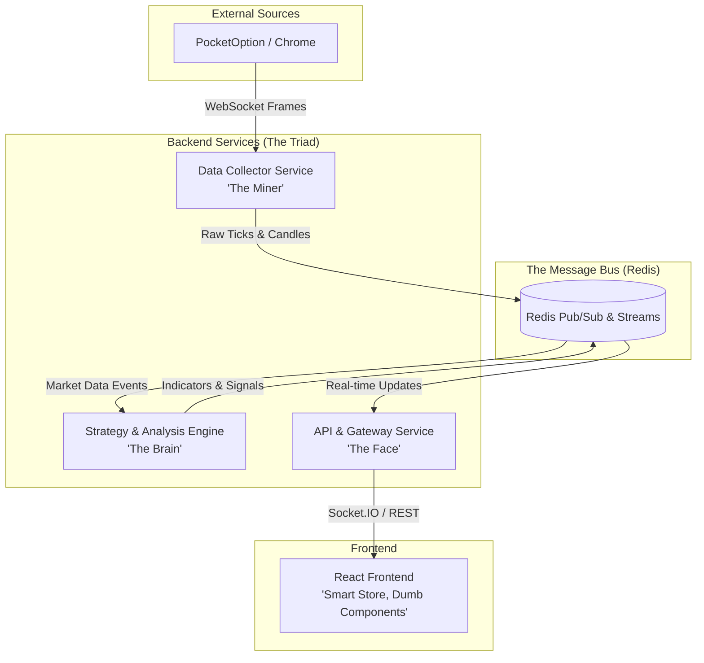

# QuFLX v2 Architecture: Event-Driven Modular Monolith

**Date**: November 26, 2025
**Status**: Draft / Foundation
**Version**: 2.0.0

## 1. Executive Summary

QuFLX v2 transitions from a monolithic Flask application to an **Event-Driven Modular Monolith**. This architecture decouples data collection, analysis, and visualization, using **Redis** as the central nervous system. This approach directly addresses previous pain points regarding frontend complexity, tight coupling, and race conditions.

## 2. Core Principles Alignment

This architecture is strictly governed by the project's Core Principles:

*   **Functional Simplicity First**: Each service has a single, well-defined responsibility. No "god objects" like the previous `streaming_server.py`.
*   **Sequential Logic**: Data flows linearly: Collection -> Normalization -> Analysis -> Distribution -> Visualization.
*   **Separation of Concerns**:
    *   *Collector* knows nothing about the *Frontend*.
    *   *Strategy Engine* runs independently of *User Sessions*.
    *   *Frontend* is a "dumb" renderer of state.
*   **Zero Assumptions**: All data entering the system is validated and normalized immediately upon ingestion.
*   **Incremental Testing**: Each module (Collector, Strategy, Gateway) can be tested in isolation by mocking Redis messages.

## 3. System Architecture

## 4. Component Specifications

### A. Data Collector Service ("The Miner")
*   **Responsibility**: Connect to Chrome/PocketOption, intercept WebSocket frames, normalize data, and publish to Redis.
*   **Input**: Raw Chrome Performance Logs.
*   **Output**: Standardized `Tick` and `Candle` objects published to Redis channels (`market_data:raw`, `market_data:candles:1m`).
*   **Key Characteristic**: Stateless and blind to the rest of the system. If the API goes down, the Collector keeps mining.

### B. Strategy & Analysis Engine ("The Brain")
*   **Responsibility**: Subscribe to market data, calculate technical indicators, and generate trading signals.
*   **Input**: Redis `market_data` channels.
*   **Output**: Published events to `indicators:update` and `signals:new`.
*   **Key Characteristic**: Independent execution. Essential for automated trading that must persist regardless of UI connection.

### C. API & Gateway Service ("The Face")
*   **Responsibility**: Manage client connections, authentication, and serve historical data.
*   **Input**: Redis subscriptions and REST requests.
*   **Output**: Socket.IO events to Frontend, JSON responses.
*   **Key Characteristic**: The only entry point for the Frontend. It acts as a bridge between the Redis bus and the User.

### D. Frontend Architecture ("Smart Store, Dumb Components")
*   **State Management**: **Zustand** store (`useMarketStore`) holds the "Truth" (candles, indicators, connection status).
*   **Visualization**: **Lightweight Charts** wrapped in small, composable components (`<ChartCanvas>`, `<CandlestickSeries>`, `<IndicatorPane>`).
*   **Logic**: Components do **not** process data. They only render what is in the Store.

## 5. Data Flow Pipeline ("The Golden Path")

1.  **Ingest**: Collector intercepts WebSocket frame -> Normalizes to `Tick(timestamp, price, asset)`.
2.  **Publish**: Collector publishes `Tick` to Redis Stream.
3.  **Process**: Strategy Engine reads `Tick` -> Updates Indicators -> Publishes `IndicatorUpdate`.
4.  **Serve**: Gateway receives `Tick` & `IndicatorUpdate` -> Emits via Socket.IO.
5.  **Visualize**: Frontend Store receives update -> Mutates State -> Chart Component re-renders efficiently.

## 6. Technology Stack

*   **Language**: Python 3.11+ (Backend), TypeScript/React (Frontend).
*   **Message Broker**: Redis (Pub/Sub for real-time, Streams for history buffer).
*   **Backend Framework**: FastAPI (Gateway), Plain Python Processes (Collector, Strategy).
*   **Frontend State**: Zustand.
*   **Visualization**: Lightweight Charts (TradingView).
*   **Validation**: Pydantic (Backend), Zod (Frontend).

## 7. Implementation Roadmap

1.  **Foundation**: Set up Redis and define Pydantic Data Models (`Tick`, `Candle`, `Signal`).
2.  **The Miner**: Build the isolated Data Collector Service. Verify it publishes to Redis.
3.  **The Face**: Build the basic API Gateway to subscribe to Redis and serve a "Hello World" stream.
4.  **The Brain**: Implement the Strategy Engine with basic indicators (SMA/RSI).
5.  **The UI**: Rebuild the Frontend using the "Smart Store" pattern and connect to the Gateway.
